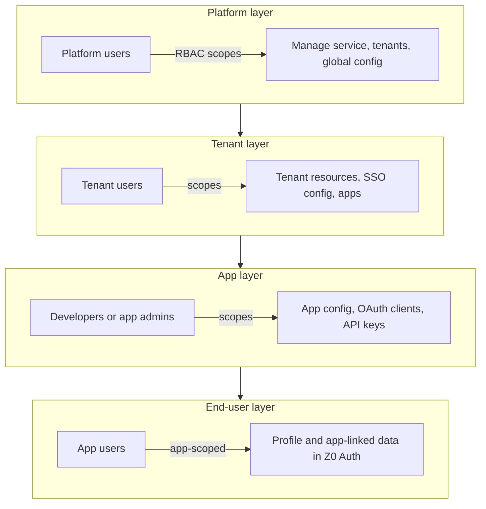

# Z0 Auth

**Z0 Auth** is a self-hostable, multi-tenant identity and access management (IAM) platform built with **Bun** and **PostgreSQL**, with **minimal external runtime dependencies**. It provides **OAuth 2.x** (modern practices, e.g. OAuth 2.1–aligned) and **OpenID Connect** for user sign-in and delegated access, **RBAC expressed as scopes** across administrative layers, **tenant-level identity** so users can sign in once and use multiple apps under the same organization, and a **React** admin console (**Tailwind CSS**, **shadcn/ui**).

This repository is in an early **definition and console-template** phase: the README describes the product; the auth server and persistence layer are not implemented here yet.

**Documentation**

- [System architecture](docs/ARCHITECTURE.md) — high-level design, routing, modules, data model, phases
- [Project guidelines](docs/GUIDELINES.md) — REST conventions, security, separate `api/` vs `console/` packages, tests, OpenAPI

---

## Why Z0 Auth

- **Self-hostable and scalable** — you operate the service, your data, and your upgrade path.
- **Small, inspectable stack** — **Bun + Postgres** reduces moving parts and third-party risk compared to large dependency-heavy IAM stacks.
- **Standards-first** — OAuth 2.x and OIDC as the primary contract for browser and mobile apps.
- **Clear layers** — platform operators, tenant administrators, app builders, and end users each have explicit boundaries and permissions.
- **Cloud-native deployment** — stateless application nodes with **PostgreSQL** as the system of record; scale horizontally behind a load balancer when you outgrow a single instance.

---

## Who it is for

- **Teams building multi-tenant products** who need an auth and admin boundary per customer organization.
- **Enterprises and platform teams** who want to self-host identity for internal and customer-facing applications.

Both share the same **core**: tenants, OIDC/OAuth, clients, tokens, and scoped administration. Day-two priorities (federation, compliance packaging, advanced isolation) can differ; those are called out under [Non-goals and roadmap](#non-goals-and-roadmap).

---

## How it works: layered access

Z0 Auth is organized into **four layers**. Each layer has its own **principals** (users or service roles) and **authorization** via **RBAC** where privileges are enforced as **scopes**. Higher layers do not automatically grant full access to everything below; access is explicit per layer.

| Layer | Principals | What they manage or access |
|--------|------------|----------------------------|
| **Platform** | Platform users | The Z0 Auth **service**: global configuration, tenant lifecycle, and service-wide operations allowed by **platform scopes**. |
| **Tenant** | Tenant users | One **tenant** (organization): tenant configuration, **apps**, tenant-level identity and SSO settings, and tenant resources allowed by **tenant scopes**. |
| **App** | Developers or app admins (within a tenant) | A single **application** under that tenant: OAuth client settings, redirect URIs, API key policies, and app metadata allowed by **app scopes**. |
| **App user** | End users | Sign-in and **app-specific** profile and linked data stored with the service for that app only—not arbitrary cross-app data unless the tenant identity and SSO model allows shared session across tenant apps (see below). |

**Host deployment modes**

- **Single-tenant** — one organization on the instance; simpler operations.
- **Multi-tenant** — many organizations on one instance; the platform layer enforces isolation and admin boundaries.



```text
Platform users (service RBAC)
        │
        ▼
Tenant / Org ──► Tenant users (tenant RBAC)
        │
        ├──► App (OAuth client + config) ──► App admins / developers (app RBAC)
        │
        └──► App users (end users, app-scoped profile / linked data)
```

---

## Authentication and authorization

### End-user and public clients: OAuth 2.x + OpenID Connect

Browser and native clients use **OAuth 2.x** and **OIDC** (e.g. authorization code with **PKCE** for public clients) for sign-in and delegated access to APIs.

### Server and automation: API keys

**Server-side** or trusted backends can use **API keys** where user delegation is not required. Keys may be issued or managed by **developers** or **end users**, depending on app policy (both are in scope for the product story). Use **API keys** for **confidential server** and machine-to-machine access; use **OAuth / OIDC** for **user-delegated** access and **public clients** (browser, mobile).

### RBAC and scopes

At each layer (platform, tenant, app), **roles** are named groupings of **scopes**. APIs, the admin console, and issued tokens should align on the same scope vocabulary over time so behavior is predictable and auditable.

### App-linked user data

Beyond standard OIDC claims, apps may persist **app-specific profile and related fields** in Z0 Auth as **app-linked user data**, always bounded by tenant and app isolation rules.

---

## SSO across apps in a tenant

User records can be stored at **tenant** level so the same person is recognized across **multiple apps** under that tenant. The product goal is **single sign-on within a tenant**: authenticate once, then use the applications that tenant offers without separate per-app passwords. Exact cookie, session, and token behavior will follow OIDC/OAuth best practices and operator configuration (issuer URL, redirect allowlists, cookie domains for sibling app hosts).

---

## Data isolation and databases

- **Default** — PostgreSQL holds platform metadata, tenant and app configuration, and identity-linked data, with **logical isolation** between tenants (and apps) in a shared database.
- **Stronger isolation** — optional patterns such as dedicated schema or database per tenant for stricter boundaries.
- **Bring your own database (BYO DB)** — optional direction for operators who need **tenant** or **app** data in a Postgres instance they already run (residency, existing ops). Connection ownership, migrations, and trust boundaries will be documented when that mode is designed.

---

## Custom domains (self-hosted)

For self-hosted deployments, a dedicated hostname (for example `auth.example.com`) is usually **operator DNS** pointing at your Z0 Auth instance. That is sufficient for many setups.

Beyond DNS, operators care about a stable **OIDC issuer URL**, **redirect URI** allowlists, and (when apps share SSO across subdomains) **cookie** and **session** domain configuration. Z0 Auth does not need to be a separate “custom domains product” for self-hosters; it is **configuration** of the deployment. Per-tenant branded hostnames for a **hosted** multi-tenant offering may be a later concern and is not required for the core self-hosted story.

---

## Admin console

Management is done through a **standard web console** built with **React**, **Tailwind CSS**, and **shadcn/ui**: configure tenants, apps, OAuth clients, API keys, roles, and scopes according to each principal’s layer and permissions.

---

## Tech stack

| Area | Choice |
|------|--------|
| Runtime / server | Bun |
| Primary datastore | PostgreSQL |
| Admin UI | React, Tailwind CSS, shadcn/ui |

External services (email, SMS, KMS, etc.) are intentionally **optional integrations** so the core service stays dependency-light.

---

## Trust boundaries

**Inside Z0 Auth:** tenant and app registry, OAuth/OIDC endpoints, token issuance, platform/tenant/app admin APIs, stored identities, app-linked user fields, API key material (hashed at rest), audit and configuration data.

**In your applications:** business logic, resource servers that validate access tokens or session choices, and any database not owned by Z0 Auth. Resource servers must treat tokens and keys as opaque capabilities and enforce their own authorization using scopes or app-specific rules.

---

## Glossary

| Term | Meaning |
|------|--------|
| **Tenant / Org** | Organizational boundary: users, apps, and configuration live under one tenant. “Tenant” and “org” are used interchangeably in conversation; docs prefer **tenant** for the technical object. |
| **Realm** | Common in other IAM products for an isolated space; Z0 Auth uses **tenant** as the first-class term. |
| **App** | A registered product or application under a tenant. |
| **OAuth client** | The OAuth/OIDC client registration for an app (client id, secrets where applicable, redirect URIs, grant types). Not the same as “tenant client” in a business sense—avoid overloading **client** in technical text. |
| **Resource server** | Your API or backend that accepts access tokens (from OAuth/OIDC or API-key flows) and enforces authorization; it runs outside Z0 Auth but trusts tokens issued by it. |
| **Platform user** | Operator of the Z0 Auth installation. |
| **Tenant user** | Administrator or member with access inside one tenant. |
| **App user** | End user who signs in to a specific app. |
| **Scope** | Fine-grained permission used for APIs, console actions, and token claims. |
| **Role** | Named set of scopes at a given layer (platform, tenant, or app). |

---

## Non-goals and roadmap

The following are **not** implied by the current product definition until explicitly designed and shipped:

- Full **enterprise IdP** parity on day one (e.g. broad **SAML** federation, **SCIM** provisioning) — may appear on a roadmap.
- A **managed** multi-tenant control plane with automated per-tenant custom domains — optional future; self-host relies on operator DNS and issuer configuration.
- **Advanced per-tenant branding** (white-label login hosts, full marketing-site customization) beyond what operator DNS and a single deployment theme provide — optional future, especially for hosted offerings.
- A **GRC** (governance, risk, compliance) suite or full audit product — Z0 Auth may emit **audit-friendly** logs and configuration, but it is not a compliance platform by itself.
- A general-purpose **application database** unrelated to identity — only **auth-linked** and **app-scoped** user data is in scope.
- Commitment to every **isolation** and **BYO DB** mode at first release — principles and a **default** shared-Postgres model come first; stronger modes follow demand.

---

## Development (template)

This repo currently includes the Bun + React + Tailwind + shadcn template used for the future admin console.

```bash
bun install
bun dev
```

Production-style run:

```bash
bun start
```

When the IAM server and database are added, this section will be expanded with configuration, migrations, and security guidance.

---

## License and status

**Status:** product definition and UI template; IAM backend not yet implemented in this tree.

Add a `LICENSE` file when you choose a license for the project.
