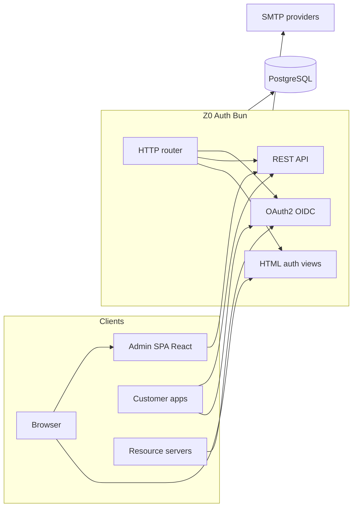
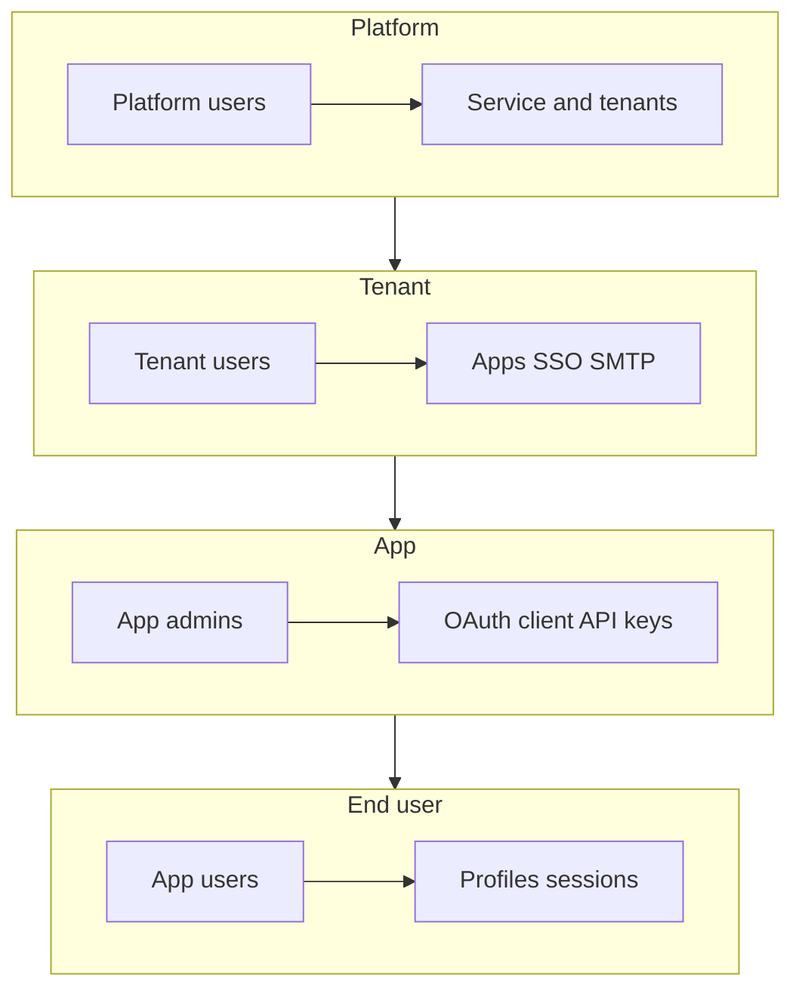
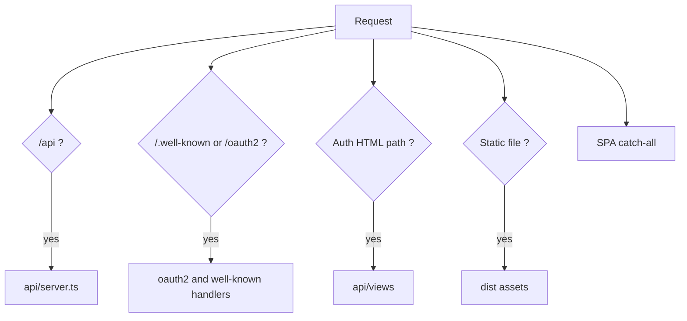
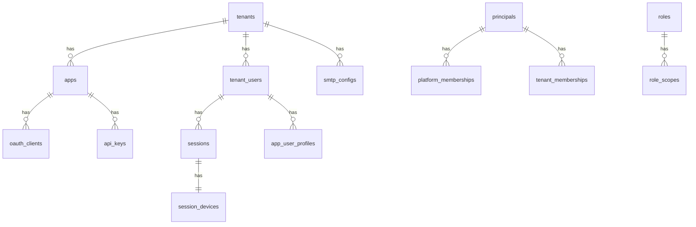

# Z0 Auth — system architecture

This document describes the high-level design for Z0 Auth. Product goals and terminology live in [README.md](../README.md). Day-to-day engineering rules live in [GUIDELINES.md](./GUIDELINES.md).

**Status:** architecture baseline — implementation follows the phases at the end of this document.

---

## 1. Architectural goals

- **Single Bun process** serves the admin SPA, JSON APIs, server HTML auth pages, and OAuth/OIDC protocol endpoints.
- **Minimal runtime dependencies** — Bun, PostgreSQL, and small focused libraries where the standard library is insufficient.
- **Multi-tenant by default** with explicit `tenant_id` isolation in storage and request context.
- **Scoped RBAC** at platform, tenant, and app layers; scopes are the enforceable unit everywhere (API, console, tokens).
- **Opaque access tokens** with **RFC 7662 introspection** for resource servers; **JWT ID tokens** for OIDC interop.
- **Tenant-scoped SMTP** with optional platform-wide defaults.
- **Passkeys (WebAuthn)** designed in the data model; implementation deferred after core auth and OIDC.

---

## 2. System context



| Actor | Interaction |
|-------|-------------|
| **Platform / tenant / app admins** | HTML login → cookie session → React console (`/`) → `/api/v1/admin/*` |
| **End users** | HTML or OAuth login → tenant SSO → app tokens / profiles |
| **Customer applications** | OAuth 2.x + OIDC (`/oauth2/*`, `/.well-known/*`) |
| **Resource servers** | Validate **opaque** access tokens via `POST /oauth2/introspect` (or short-lived cache) |
| **Operators** | Self-host Bun + Postgres; configure issuer URL, DNS, platform/tenant SMTP |

---

## 3. Layered access model

Z0 Auth mirrors the four layers from the product README. Authorization never “inherits” downward without explicit membership and scopes.

| Layer | Principals | Typical capabilities |
|-------|------------|----------------------|
| **Platform** | Platform users | Tenants lifecycle, platform SMTP default, platform roles, system settings |
| **Tenant** | Tenant users | Tenant config, apps, tenant users, tenant SMTP, tenant roles, SSO settings |
| **App** | App admins / developers | OAuth client, redirect URIs, API keys, app roles, app profile schema |
| **App user** | End users | Own profile, sessions, app-linked data; OIDC flows for customer apps |



**Host modes:** single-tenant (one org per instance) or multi-tenant (many orgs; platform layer enforces boundaries).

---

## 4. Repository layout (separate API and console)

The **API** and **console UI** are **top-level siblings**, not nested under a shared `src/` tree. This keeps a hard boundary so the console can be extracted to its own repo or deployment (CDN, separate origin) with minimal changes—point `VITE_API_BASE_URL` (or equivalent) at the API host and ship `console/dist` independently.

```text
api/                              # Backend only — Bun service
  package.json                    # Optional: api-only deps
  src/
    index.ts                      # Bun.serve entry
    server.ts
    middleware/
    auth/                         # /api/auth/*
    v1/
      admin/
        platform/
        tenants/
        apps/
      me/
      audit/
    oauth2/
    well-known/
    modules/                      # Domain logic (shared by routes)
    views/                        # Server HTML (setup, login, …)
    db/
  tests/                          # Mirrors src resource paths (see GUIDELINES)

console/                          # Frontend only — React admin SPA
  package.json                    # Optional: console-only deps
  src/
    main.tsx
    router.tsx
    routes/                       # Mirror admin resource tree
    components/
    lib/                          # HTTP client → API base URL only
    styles/
    index.html
  tests/                          # Mirrors src route/component paths

docs/
  ARCHITECTURE.md
  GUIDELINES.md
  openapi/                        # OpenAPI 3.x — mirrors api/src resources
    auth/
    v1/
      admin/
        platform/
        tenants/
        apps/
      me/
      audit/
    oauth2/

e2e/                              # Cross-stack integration (optional root)
  tests/
```

**Boundary rules**

| Rule | Rationale |
|------|-----------|
| No `api` imports in `console` | UI talks HTTP only; enables moving console out |
| No `console` imports in `api` | API never embeds React source |
| No shared `src/` mixing UI and handlers | Clear ownership per package |
| API may **serve** `console/dist` static files in dev/single-host mode | Deployment convenience, not source coupling |

**Single-host dev (default):** `api` process serves built console assets from `console/dist` at `/` and API at `/api`. **Split-host:** console static on CDN, API on `api.example.com`; CORS + cookie domain documented per deployment.

Legacy template files under repo `src/` migrate into `api/` and `console/` during Phase 1.

---

## 5. HTTP routing

Registration order in `src/index.ts` (first match wins):

1. `/api/*` — JSON API
2. `/.well-known/*`, `/oauth2/*` — OIDC/OAuth (spec root paths)
3. `/setup`, `/login`, `/register`, `/forgot-password`, `/verify-email` — server HTML
4. Static assets (built SPA chunks, `shared.css`)
5. `/*` — SPA shell (`src/app/index.html`) for React Router



### 5.1 API surface

| Area | Prefix | Versioning |
|------|--------|------------|
| Session auth | `/api/auth` | Unversioned (stable contract) |
| Admin CRUD | `/api/v1/admin` | Versioned |
| End-user | `/api/v1/me` | Versioned |
| Audit queries | `/api/v1/audit` | Versioned |
| Health | `/api/health` | Unversioned |
| OAuth/OIDC | `/oauth2`, `/.well-known` | Protocol (not under `/api/v1`) |

See [GUIDELINES.md](./GUIDELINES.md) for REST conventions and example routes.

### 5.2 Server HTML (no React SSR in v1)

Public and pre-authentication flows use **HTML templates** in `src/api/views/`:

| Route | Purpose |
|-------|---------|
| `GET /setup` | First platform super-admin (only when no platform admin exists) |
| `GET /login` | Password session login |
| `GET /register` | Invitation or tenant-open registration |
| `GET /forgot-password` | Trigger reset email |
| `GET /verify-email` | Complete email verification link |

Templates link a **shared stylesheet** (`dist/shared.css`) built from the same Tailwind theme as the SPA so visuals match shadcn-style components. Forms POST to `/api/auth/*` with **HttpOnly session cookies**; success redirects into the SPA.

React SSR for these routes is **out of scope for v1** to avoid a second server bundle.

### 5.3 Admin console SPA (`console/`)

Lives in the **`console/`** package (not inside `api/`). React Router routes should mirror the admin resource tree (e.g. `routes/platform/tenants/` ↔ `api/v1/admin/platform/tenants`).

| Route pattern | Audience |
|---------------|----------|
| `/` | Role-based redirect |
| `/platform/*` | Platform admins |
| `/t/:tenantId/*` | Tenant admins |
| `/t/:tenantId/apps/:appId/*` | App admins |

Unauthenticated access to SPA routes redirects to `GET /login` (HTML served by `api`).

**Extracting the console later:** move or copy the `console/` directory; keep `lib/api.ts` base URL configurable; no server code changes beyond static hosting and CORS.

---

## 6. Core modules

| Module | Responsibility |
|--------|----------------|
| **authn** | Login, logout, passwords, sessions, device records, lockout; passkey hooks (deferred) |
| **authz** | Scope registry, role expansion, `requireScopes`, fail-closed enforcement |
| **oidc** | Authorization code + PKCE, token endpoint, refresh rotation, introspection, JWT ID tokens |
| **admin** | Platform / tenant / app CRUD |
| **profiles** | Tenant user identity + app-linked JSONB profiles |
| **audit** | Append-only `audit_events`, query API |
| **notify** | SMTP config (platform + tenant), templates, outbox worker |
| **devices** | Session ↔ device metadata (UA, IP, label, client type) |
| **keys** | API key generation, hashing, scope binding |

Route handlers stay thin: parse request → call module → map to Problem Details on error → emit audit event on mutations.

---

## 7. Authentication and tokens

### 7.1 Credential types

| Mechanism | Use case | Priority |
|-----------|----------|----------|
| **Session cookie** | Console + HTML auth | P0 |
| **Password** | Login, reset, verify email | P0 |
| **OAuth 2.x + OIDC** | Customer browser/mobile apps | P1 |
| **API keys** | Server / M2M per app | P1 |
| **Passkeys** | WebAuthn | P4 (deferred) |
| **TOTP** | Backup MFA | P3 |

### 7.2 Token strategy

| Artifact | Format | Storage / validation |
|----------|--------|----------------------|
| **Access token** | Opaque (`z0_at_…`) | Hash in DB; validate via introspection |
| **Refresh token** | Opaque | Rotated on use; bound to `session_id` |
| **ID token** | JWT | Signed with platform key; JWKS at `/.well-known/jwks.json` |
| **API key** | Opaque (`z0_ak_…`) | Hash in DB; introspection `token_type` = api_key |
| **Session id** | Opaque cookie | Maps to `sessions` + `session_devices` |

**Introspection** (`POST /oauth2/introspect`, RFC 7662): returns `active`, `sub`, `scope`, `client_id`, `tenant_id`, `app_id`, `exp`, `token_type`.

Resource servers should cache introspection results briefly (e.g. 30–60s) and honor revocation via `active: false`.

Optional first-party helper: `GET /api/v1/tokens/verify` (same logic, JSON for internal apps).

### 7.3 Session and device management

Every interactive login creates or updates:

- `sessions` — expiry, revocation, auth method
- `session_devices` — user agent, IP, derived device label, client type (web, mobile, api)

End-user APIs:

- `GET /api/v1/me/sessions` — list active sessions
- `DELETE /api/v1/me/sessions/:sessionId` — revoke one
- `POST /api/v1/me/sessions/revoke-others` — keep current only

Security emails (new device, credential change) use tenant SMTP when configured.

---

## 8. Authorization (scopes)

- Scopes are namespaced: `platform:…`, `tenant:…`, `app:…`, `profile:…`, `audit:read`, etc.
- **Roles** bundle scopes per layer; principals gain roles via memberships.
- Middleware chain: `requestId` → `tenantContext` → `resolvePrincipal` → `loadScopes` → `requireScopes` → handler.
- **Fail closed:** missing or invalid auth → `401`; valid auth, missing scope → `403`.
- Console UI gates features using the same scope list returned by `GET /api/auth/session`.

Initial scope registry will be defined in a follow-up `docs/SCOPES.md` or migration seed (Phase P0).

---

## 9. Data architecture

### 9.1 Default deployment

Single PostgreSQL database, **row-level isolation** via `tenant_id` (and `app_id` where relevant). All repositories require tenant context for tenant-scoped tables.

### 9.2 Core entities (v1)



**Table groups:**

| Group | Tables |
|-------|--------|
| **Registry** | `platform_settings`, `tenants`, `apps` |
| **Principals & RBAC** | `principals`, `*_memberships`, `roles`, `role_scopes`, `scope_definitions` |
| **Identity** | `tenant_users`, `tenant_user_profiles`, `app_user_profiles`, `credentials`, `webauthn_credentials` (placeholder) |
| **Sessions** | `sessions`, `session_devices` |
| **OAuth** | `oauth_clients`, `authorization_codes`, `access_tokens`, `refresh_tokens`, `token_revocations` |
| **API keys** | `api_keys` |
| **Audit** | `audit_events` |
| **Email** | `smtp_configs`, `email_templates`, `email_outbox` |
| **Ops** | `invitations`, `rate_limit_buckets` |

### 9.3 SMTP

| Level | Behavior |
|-------|----------|
| **Platform** | Default SMTP for system mail (setup, platform-only alerts) |
| **Tenant** | Override SMTP host, credentials, from-address; used for tenant user mail |

Credentials encrypted at rest. Outbox table with retry and dead-letter status.

### 9.4 Profiles

- **Tenant profile** — email, name, avatar, locale, verification flags (OIDC claims source).
- **App profile** — `app_user_profiles.data` JSONB validated against per-app schema registered in admin API.

### 9.5 Future isolation (documented, not v1)

- Schema-per-tenant or database-per-tenant
- BYO DB attachment for tenant/app data

---

## 10. Audit logging

Append-only `audit_events` for security and operations.

| Field | Description |
|-------|-------------|
| `occurred_at` | UTC timestamp |
| `actor_principal_id` | Who acted |
| `tenant_id`, `app_id` | Context (nullable for platform) |
| `action` | Stable verb e.g. `tenant.app.create` |
| `resource_type`, `resource_id` | Target |
| `ip`, `user_agent`, `request_id` | Request metadata |
| `metadata` | JSONB — **no secrets** |

Emit on: auth success/failure, session revoke, admin mutations, OAuth client changes, API key lifecycle, SMTP changes, profile updates.

Query API scoped by layer (`/api/v1/audit` with platform/tenant/app filters).

---

## 11. Feature inventory and priorities

| Feature | Phase | Notes |
|---------|-------|-------|
| Scoped authn/authz | P0 | Middleware + scope registry |
| Bootstrap `/setup` | P0 | HTML + platform admin seed |
| Health check | P0 | `GET /api/health` |
| Admin CRUD | P0–P1 | `/api/v1/admin/*` |
| Audit log | P0 | Write + query |
| Sessions & devices | P0–P1 | Me API + audit |
| Tenant SMTP | P1 | Required in v1 |
| Email verify / password reset | P1 | Uses SMTP |
| OAuth/OIDC + opaque tokens | P1–P2 | Root protocol paths |
| Introspection | P2 | RFC 7662 |
| API keys | P2 | App-scoped |
| Invitations | P2 | Tenant/app users |
| Rate limiting | P2 | Login, token, admin |
| User profiles | P2–P3 | Tenant + app JSONB |
| React admin console | P3 | `console/` package |
| Security notification emails | P3 | New device, etc. |
| Webhooks | P3 | `user.created`, `session.revoked`, … |
| Token revocation list | P3 | Opaque token denylist |
| TOTP MFA | P4 | After passkeys design |
| Passkeys | P4 | WebAuthn — deferred |
| SAML / SCIM / BYO DB | — | README non-goals |

---

## 12. Trust boundaries

**Inside Z0 Auth**

- Identity store, sessions, tokens (hashed), OAuth state, API keys (hashed), SMTP secrets (encrypted), audit trail, admin configuration.

**Outside Z0 Auth**

- Customer business logic and databases.
- Resource servers: must call introspection (or trusted cache), enforce scopes, never trust unsigned client claims alone.

**Secrets**

- Platform signing keys via environment or secure file mount.
- Never log passwords, tokens, API keys, or SMTP passwords.

---

## 13. Cross-cutting concerns

| Concern | Approach |
|---------|----------|
| **Request ID** | `X-Request-Id` or generated UUID on every request |
| **Tenant context** | `X-Tenant-Id` header (primary); subdomain mapping optional later |
| **Idempotency** | `Idempotency-Key` on create POSTs |
| **Errors** | RFC 7807 Problem Details — see GUIDELINES |
| **Rate limits** | Per-IP and per-identifier buckets on auth endpoints |
| **Migrations** | Sequential SQL in `api/src/db/migrations` |
| **Observability** | Structured logs with `request_id`, `tenant_id`; no PII in debug without policy |

---

## 14. API documentation (OpenAPI)

Every REST resource or auth action has a matching **OpenAPI 3.x** spec under `docs/openapi/`, using the **same folder path** as the implementing code in `api/src/`.

Example:

```text
api/src/v1/admin/tenants/handler.ts
docs/openapi/v1/admin/tenants/tenants.openapi.yaml
api/tests/v1/admin/tenants/handler.test.ts
```

Specs are the contract for Postman, API gateways, and external integrators. When a handler changes, the OpenAPI file for that resource updates in the same PR. CI validates spec ↔ route consistency (lint + optional contract tests).

Bundled entry: `docs/openapi/openapi.yaml` may `$ref` per-resource files for a full export.

---

## 15. Testing strategy

| Layer | Location | Purpose |
|-------|----------|---------|
| **Unit** | `api/tests/...` mirrors `api/src/...` | Modules, authz, validation |
| **API integration** | `api/tests/.../*.integration.test.ts` | Real Postgres (test DB), HTTP handlers |
| **Console unit** | `console/tests/...` mirrors `console/src/...` | Components, hooks, client |
| **E2E** | `e2e/tests/` | Full flows: setup, login, CRUD tenant (Playwright or Bun driving HTTP + browser) |

**Policy:** new features ship with unit tests; strive for high coverage on `api/src/modules` and auth paths. Integration tests required for new or changed API endpoints. E2E for critical user journeys (auth, tenant create, token introspection).

Coverage thresholds (enforced in CI when wired): modules ≥ 80%; authn/authz/oidc ≥ 90%.

---

## 16. Build and deployment

| Artifact | Package | Output |
|----------|---------|--------|
| Console SPA | `console/` | `console/dist/` |
| Shared CSS (HTML views) | `api/` build step | `api/dist/shared.css` or `console/dist/shared.css` copied at api build |
| API server | `api/` | `bun api/src/index.ts` |

**Cloud-native:** horizontal scale of stateless API workers; session state in Postgres; console on CDN optional.

**Configuration:** `DATABASE_URL`, `ISSUER_URL`, `SESSION_SECRET`, signing keys; `CONSOLE_ORIGIN` / `API_PUBLIC_URL` for CORS and console client config.

---

## 17. Implementation phases

| Phase | Deliverables |
|-------|----------------|
| **0 — Docs** | `ARCHITECTURE.md`, `GUIDELINES.md`, OpenAPI layout, test layout |
| **1 — Structure** | `api/` + `console/` packages; routing skeleton; CI test + openapi lint stubs |
| **2 — P0 Foundation** | Postgres, migrations, middleware, `/setup`, `/api/auth`, audit write, health |
| **3 — P1 Govern** | Admin CRUD, tenant SMTP, sessions/devices API |
| **4 — P2 Protocol** | OAuth/OIDC, opaque tokens, introspection, API keys |
| **5 — P3 Console** | `console/` React Router SPA, profiles, invitations, webhooks |
| **6 — P4 Hardening** | Passkeys, TOTP, denylist, security emails polish |

---

## 16. Related documents

- [README.md](../README.md) — product vision and glossary
- [GUIDELINES.md](./GUIDELINES.md) — engineering standards and API conventions
