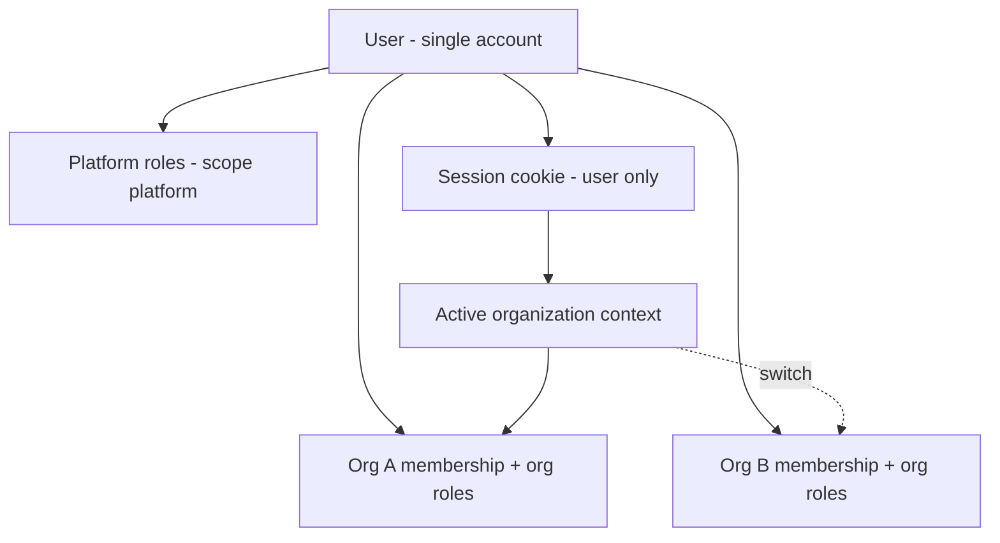

# Data model and tenancy (v1)

Normative model for P1-M1 and later modules. **HTTP contracts** stay in `docs/api/`; this document is the database and access-boundary source of truth.

---

## Terminology

| In code / DB / API fields | In UI (user-facing) |
|---------------------------|---------------------|
| `tenant`, `tenant_id`, `tenants` | **Organization** (org) |
| `tenant_memberships` | Membership in an organization |
| Platform | The single z0-auth deployment (self-hosted instance) |

**Rule:** Implement with `tenant*` names in SQL, TypeScript, and JSON property names (`tenant`, `tenantId`). Use “organization” only in labels, help text, and marketing copy unless an OpenAPI field is already published (e.g. setup `organizationName` maps to creating a `tenants` row).

---

## Locked decisions (2026-05-29)

| Topic | Decision |
|-------|----------|
| **User identity** | One `users` row per person for the whole platform instance. Same user for platform ops, org membership, and OAuth-backed apps. |
| **Email** | Globally unique per instance (`lower(email)` on `users`). No per-tenant duplicate emails. |
| **Strong isolation** | Not modeled in v1. Operators who need hard separation run **another instance** of the service. |
| **Organizations** | Optional grouping. Setup creates one default org; users may create more orgs or stay on the single default org. |
| **RBAC** | Scoped roles: `platform` vs `tenant` on one role catalog; permissions attached to roles; assignments via `user_roles` with `tenant_id` NULL (platform) or set (org). |
| **Session** | Cookie proves **who** (`user_id`). **Active org** is separate state (preference + optional `z0_tenant` cookie later), validated against `tenant_memberships`. |
| **Invites** | Explicit accept / invite token when linking users to orgs (`tenant_invites`, `/auth/invite/:token`). |

---

## Access model (how it works)

### One person, many hats

1. **Authenticate** → session bound to `users.id` only.
2. **Resolve active org** → from user preference, cookie, or default (first membership, prefer org marked `is_default` on `tenants`).
3. **Authorize** → combine platform roles (no `tenant_id`) with org roles for `active_tenant_id` only.
4. **Tenant-scoped APIs** → require active org + membership; deny if user cannot access that org.

Platform admins may have platform roles without belonging to every org; org APIs still require an active org context when acting on org data.

### Self-hosted expectations

- Most small deployments use **one org** created at setup; no switcher is shown until they belong to a second org.
- Users may create **multiple orgs** on the same instance for teams/projects.
- **Console org switcher:** whenever a user belongs to **more than one** organization, the UI **must** offer switching the active organization (no hiding the control for multi-org members). UI label: organization; persisted state: `tenant_id`.

### Apps and OAuth

- OAuth clients and tokens are scoped to an org (`tenant_id` on client and tokens).
- Resource owner is always the global `users.id`; org scope limits what the token can do.

---

## Entity overview (target v1)

### Identity

| Table | Purpose |
|-------|---------|
| `users` | Global person: email, name, status. No password column after migration. |
| `password_credentials` | Hashed password(s) for local login; linked to `users.id`. |

### Organizations

| Table | Purpose |
|-------|---------|
| `tenants` | Organization record: name, slug, `is_default`. |
| `tenant_memberships` | User belongs to org (legacy enum role until migrated to `user_roles`). |

### Authorization

| Table | Purpose |
|-------|---------|
| `roles` | Named role; `scope` = `platform` \| `tenant`. |
| `permissions` | Atomic capability key (e.g. `users:read`). |
| `role_permissions` | Many-to-many. |
| `user_roles` | `user_id`, `role_id`, `tenant_id` NULL for platform scope else org id (partial unique indexes; not a composite PK because `tenant_id` is nullable). |

**Migration note:** Seed roles from current enums (`platform_admin`, `tenant_admin`, …). Deprecate enum columns on membership tables after cutover.

### Sessions and preferences

| Table | Purpose |
|-------|---------|
| `sessions` | `user_id`, token hash, expiry, revocation, device metadata. No `tenant_id`. |
| `user_preferences` | `active_tenant_id` (nullable) for console org switcher. |

### OAuth (planned tables, implement structure in P1-M1)

| Table | Purpose |
|-------|---------|
| `oauth_clients` | `tenant_id`, redirect URIs, client type, secrets. |
| `oauth_authorization_codes` | One-time codes, PKCE, expiry. |
| `oauth_tokens` | Access / refresh tokens, rotation fields. |

Endpoints remain `x-z0-status: planned` in OpenAPI until P3 modules ship.

### Audit

| Table | Purpose |
|-------|---------|
| `audit_events` | Append-only: actor, action, resource, `tenant_id` when org-relevant, payload JSON, timestamp. |

---

## Tenancy boundaries

| Data | Scoped by |
|------|-----------|
| `users`, `password_credentials`, `sessions` | Platform (instance) |
| `tenants`, `tenant_memberships`, org-scoped RBAC | `tenant_id` |
| `oauth_clients`, codes, tokens | `tenant_id` |
| `audit_events` | `tenant_id` nullable (platform events NULL) |

**Uniqueness**

- `users`: `UNIQUE (lower(email))`
- `tenants`: `UNIQUE (slug)` globally on instance
- `tenant_memberships`: `PRIMARY KEY (user_id, tenant_id)` — one membership row per user per org (roles via `user_roles`)

**Query rule:** Any handler that reads or writes org-owned rows must filter by `tenant_id = active_tenant_id` and verify membership (or platform permission that explicitly allows cross-org admin).

---

## Session and active organization

| Layer | Responsibility |
|-------|----------------|
| `z0_session` cookie | Identifies the user session |
| Active org | `user_preferences.active_tenant_id` and/or future `z0_tenant` cookie |
| `GET /api/auth/session` | Returns user, platform roles, active org, org roles, **all organizations** the user belongs to, and `canSwitchOrganization` when count > 1 |
| `POST /api/auth/active-tenant` | Set active org (`tenantId` in body); membership required |

Changing active org does not require re-login. Invalid or non-member `tenant_id` → ignore and fall back to default org resolution.

**UI rule:** if `canSwitchOrganization` is `true`, the console always shows the organization switcher.

---

## v1 permission seed (minimal)

Start small; expand per module in the validation matrix.

| Permission | Typical scope |
|------------|----------------|
| `platform:manage` | Platform |
| `tenants:create` | Platform or org (product decision per endpoint) |
| `tenants:read` | Org |
| `users:read` / `users:invite` | Org |
| `sessions:revoke` | Self + org admin |

Map existing enum roles to permission bundles in migration seed data.

---

## P1-M1 delivery split

| In P1-M1 | Later module |
|----------|----------------|
| This document + migrations (`password_credentials`, RBAC, `audit_events`, OAuth stubs, `user_preferences`) | — |
| Session API + `POST /api/auth/active-tenant` | — |
| Console basic layout + session chrome | — |
| Console: logout (API+CSRF), org switcher, setup/login integration | — |
| Create organization API + console form | **Deferred P2** — not Phase 1 |
| Invite / accept flow | P1-M3+ |

---

## Related docs

- [ARCHITECTURE.md](./ARCHITECTURE.md)
- [api/security-contract.md](./api/security-contract.md)
- [api/CONTRACTS.md](./api/CONTRACTS.md)
