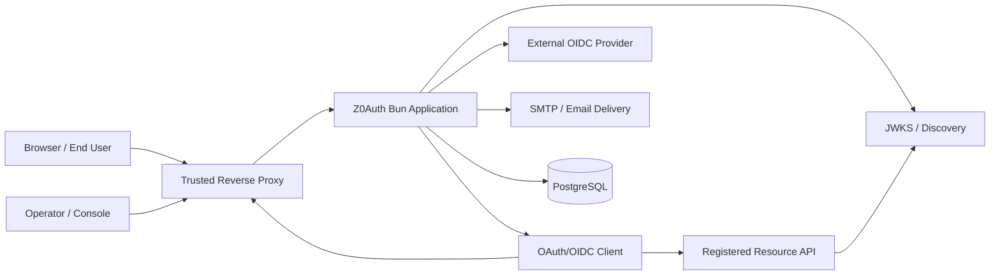
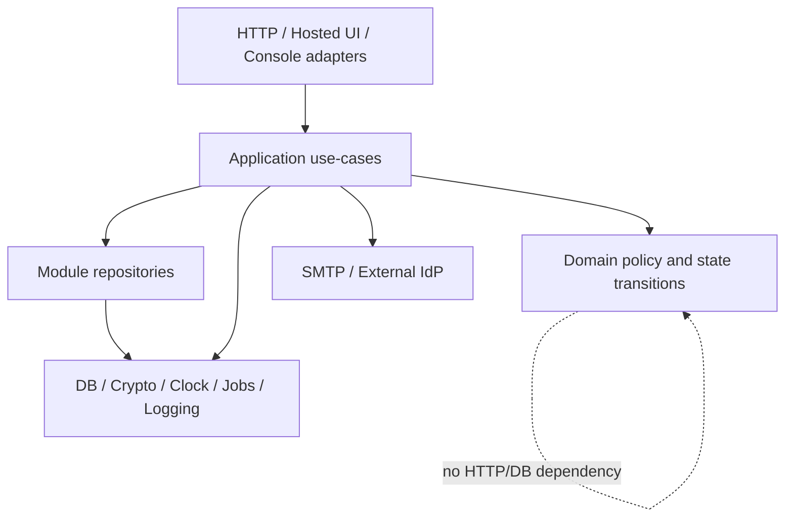
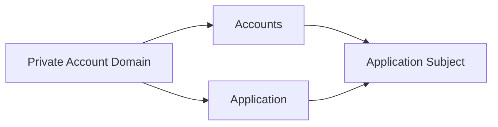
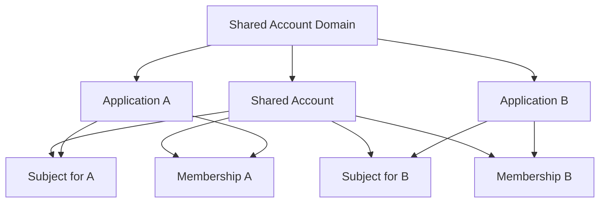
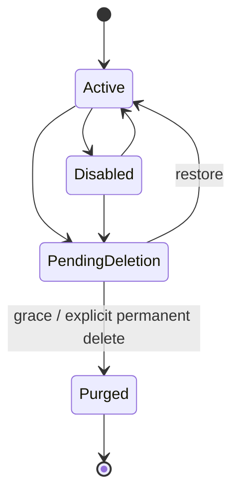
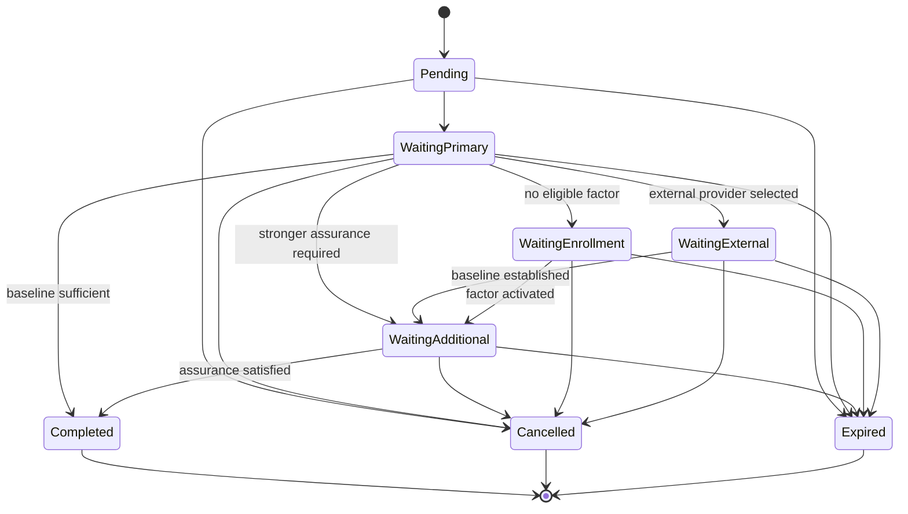
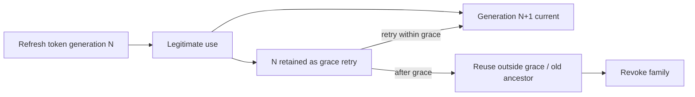
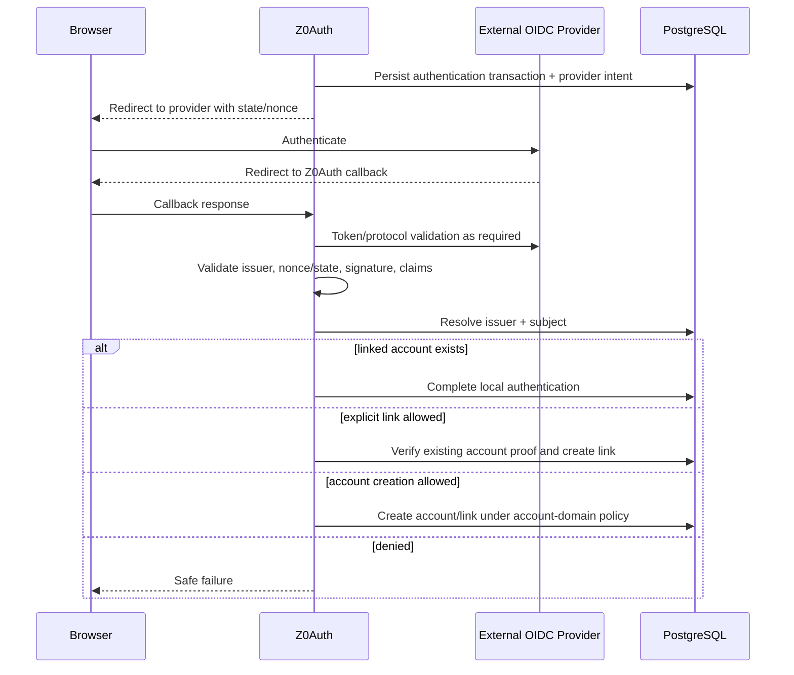

> **Status:** Stable Alpha architecture specification — audit passed
> **Release:** Alpha
> **Purpose:** Primary implementation-design source for Z0Auth Alpha.
> **Audience:** Contributors, reviewers, implementation agents, issue authors, and operators designing or changing Alpha behavior.
# 1. Purpose and authority
This document defines the implementation architecture for Z0Auth Alpha. It is intentionally detailed enough to drive repository structure, implementation tickets, migrations, protocol behavior, security review, and test design without requiring contributors to reconstruct settled product decisions.
The architecture must preserve the stable product requirements, canonical domain terminology, and threat boundaries. When this document leaves a genuine implementation choice open, the choice should either be local and reversible or captured in an Architecture Decision Record before it changes a cross-cutting contract.
Existing repository structure and behavior may be reused where they conform to this specification. Existing code does not override this specification.
# 2. Architectural goals
The Alpha architecture optimizes for:
- **Security-state correctness over distribution complexity.** Authority transitions should be explicit, atomic, and inspectable.
- **A small operational footprint.** Bun plus PostgreSQL is the complete required server-side runtime stack for Alpha.
- **Dependency-light implementation.** Prefer Bun/runtime/platform capabilities and direct standards-based code where they are sufficient.
- **One coherent self-hosted service.** Alpha is a modular monolith, not a collection of microservices.
- **Replica safety.** Multiple application replicas may run against the same authoritative PostgreSQL state without divergent security decisions.
- **Protocol interoperability.** OAuth/OIDC behavior is implemented as a standards-facing boundary, not as application-specific shortcuts.
- **Clear authority ownership.** Identity, authentication, sessions, grants, resources, applications, operators, and application-owned authorization remain distinct.
- **Failure that preserves security meaning.** Database, key, email, or external-provider failures must not silently create partial authority.
- **Implementation traceability.** Every feature issue should be able to cite a concrete architecture section, affected state, and acceptance evidence.
- **Publication readiness.** The document should be understandable outside the private planning context and suitable for mirroring into repository documentation.
# 3. Non-goals
Alpha architecture does not introduce:
- internal organization/SaaS tenant multitenancy;
- cross-instance federation;
- active-active multi-region writes;
- a required Redis, Kafka, external queue, service mesh, or distributed cache;
- a separate authentication microservice, token microservice, or worker service;
- online access-token introspection as an authorization dependency;
- per-user OAuth consent storage;
- DPoP or mTLS sender-constrained tokens;
- human on-behalf-of/token-exchange delegation;
- dynamic client registration, PAR, or JAR;
- adaptive risk scoring;
- KMS/HSM as a required deployment dependency.
# 4. System architecture
Z0Auth Alpha is a **modular monolith** executed by Bun. One deployed application image may expose public protocol endpoints, hosted authentication pages, the operator console/API, and background job execution. PostgreSQL is the authoritative state store.
The logical architecture is:

PostgreSQL is authoritative for security state. In-process memory may cache immutable or safely refreshable data, but it is never the sole authority for credentials, sessions, transactions, grants, revocations, one-time credentials, signing-key status, lifecycle state, or privileged ownership state.
# 5. Deployment topology
## 5.1 Required components
A production Alpha deployment requires:
- one or more Z0Auth application replicas;
- one PostgreSQL database reachable by every replica;
- one stable canonical public HTTPS origin;
- deployment-provided secret material;
- SMTP only when email-dependent features are enabled;
- optional explicitly trusted reverse proxy/load balancer.
No other stateful infrastructure is required.
## 5.2 Replica model
Application replicas are replaceable compute. They share:
- PostgreSQL authoritative state;
- the same canonical public origin and WebAuthn RP ID;
- the same deployment secret/key set required to decrypt protected state;
- compatible application/schema versions.
A replica must not assume sticky sessions.
Any operation that changes security authority must remain correct when two replicas execute competing requests concurrently.
## 5.3 Primary deployment shape
The supported production shape is HTTPS at a trusted edge/reverse proxy with HTTP or HTTPS forwarding to Z0Auth on a private network. Direct Bun TLS may remain possible, but the architecture does not depend on it.
The application trusts forwarded scheme, host, or client-address metadata only from explicitly configured proxy peers.
## 5.4 Canonical public origin
Production configuration defines one canonical PUBLIC_ORIGIN consisting of scheme, host, and optional port, with no query or fragment.
The canonical origin drives:
- OAuth/OIDC issuer identity;
- generated endpoint URLs and metadata;
- security-link generation;
- secure-cookie assumptions;
- trusted redirect/callback generation owned by Z0Auth;
- WebAuthn origin validation.
WebAuthn RP_ID is separately explicit because valid RP-ID configuration is not always identical to the origin host.
No security boundary is derived from an arbitrary Host or X-Forwarded-Host header.
# 6. Process and execution model
## 6.1 Bun runtime
Bun is the baseline server-side runtime.
Preferred platform capabilities include:
- Bun.serve for HTTP;
- Web Crypto / crypto primitives for cryptographic operations;
- Bun-native PostgreSQL access where it satisfies correctness and support needs;
- Bun tooling for build/test tasks where appropriate.
A third-party dependency is justified only when it provides concrete security, interoperability, correctness, accessibility, or maintainability value beyond a small internal implementation.
## 6.2 One binary, multiple roles
The same application artifact may run:
- HTTP request handling;
- background outbox processing;
- lifecycle delivery/checkpoint operations;
- cleanup of expired state.
These are logical roles, not separate services. Deployments may later run worker-only replicas if operationally useful, but Alpha correctness must not require that topology.
## 6.3 Request admission context
Every incoming request receives an immutable request context produced at the HTTP edge containing, where applicable:
- correlation/request ID;
- trusted effective origin;
- direct peer and derived client IP;
- authenticated operator context;
- authenticated account-domain session context;
- client authentication context;
- current UTC clock reading;
- configuration generation/version.
Lower-level modules do not reinterpret raw forwarding headers or cookies independently.
# 7. Internal module boundaries
The server is organized as explicit domain/application modules rather than route-centric feature folders.
Recommended logical modules:
- **platform/config** — startup configuration, public origin, proxy trust, feature/policy configuration.
- **platform/db** — PostgreSQL connection, transactions, migration version checks, repository primitives.
- **platform/crypto** — encryption, HMAC/digest helpers, random generation, constant-time comparison.
- **platform/jobs** — PostgreSQL outbox/worker claiming and retry.
- **platform/logging** — structured operational logs, correlation IDs, redaction.
- **identity** — account domains, accounts, identifiers, subjects, membership, lifecycle.
- **applications** — applications, clients, resources, scopes, redirect/origin registration, client lifecycle.
- **authentication** — authentication transactions, passwords, email credentials, TOTP, passkeys, recovery.
- **sessions** — account-domain sessions, browser session credentials, assurance/freshness continuity, logout.
- **oauth** — authorization transactions, codes, grants, token issuance, revocation, metadata, UserInfo.
- **federation** — upstream OIDC provider configuration, login, linking, unlinking.
- **operators** — Platform Owner, operator principals, RBAC, privileged step-up, owner transfer/recovery.
- **keys** — JWT signing-key lifecycle and JWKS.
- **audit** — typed append-only security/administrative events.
- **lifecycle** — durable identity lifecycle feed and consumer checkpoints.
- **notifications** — SMTP configuration and purpose-specific messages.
- **web/auth** — server-controlled hosted authentication/account pages.
- **web/console** — React operator console.
- **http** — route composition and protocol/JSON adapters.
## 7.1 Dependency direction
HTTP/UI adapters call application/use-case services. Use-case services coordinate domain policy and repositories. Domain policy must not depend on HTTP, React, SMTP, or PostgreSQL-specific row shapes.
Modules must not directly import another module's repository to mutate its state. Cross-module authority changes are coordinated through an explicit application service so the transaction boundary is visible.
Avoid a generic shared "utils" domain layer that becomes an undeclared coupling point.

# 8. Repository layout target
A target source layout is:
```plain text
src/
  server.ts
  http/
    routes/
    middleware/
    errors/
  modules/
    identity/
    applications/
    authentication/
    sessions/
    oauth/
    federation/
    operators/
    keys/
    audit/
    lifecycle/
    notifications/
  platform/
    config/
    db/
      migrations/
    crypto/
    jobs/
    logging/
    clock/
  web/
    auth/
    console/
tests/
  unit/
  integration/
  protocol/
  concurrency/
  failure/
  e2e/
docs/design/alpha-architecture.md
```
This is a target ownership map, not a requirement to rename conforming code mechanically. Repository reconciliation should map current files to these responsibilities and change structure only where boundaries are materially unclear or unsafe.
# 9. PostgreSQL persistence architecture
## 9.1 Database role
PostgreSQL is the sole authoritative persistence layer for Alpha security state.
No security-critical state may exist only in:
- application memory;
- browser local storage;
- an external cache;
- a background worker queue.
## 9.2 SQL strategy
Prefer direct PostgreSQL and explicit SQL over an ORM.
The database layer should expose:
- typed repository functions;
- a small transaction abstraction;
- explicit row-to-domain mapping;
- migration-managed schema;
- no hidden lazy loading or automatic relationship persistence.
If Bun-native PostgreSQL access cannot meet correctness/support requirements, changing the driver requires an ADR but does not change repository/domain contracts.
## 9.3 Migration strategy
Migrations are explicit, ordered, checksummed SQL migrations.
Production replicas do **not** independently auto-migrate on startup.
Production flow is:
1. run migration preflight;
2. run the migration job exactly once under a database advisory lock;
3. verify schema version;
4. roll compatible application replicas;
5. perform any explicitly documented finalization/contract step.
Application readiness fails when the schema is outside the version range supported by the running build.
Down migrations are not a general rollback promise. If the previous binary cannot safely read the current schema, restore from a compatible backup is the recovery path.
## 9.4 PostgreSQL feature baseline
Implementation should remain compatible with PostgreSQL 16 features unless an ADR deliberately raises the minimum. Release documentation declares the exact versions actually qualified.
# 10. Logical persistence model
The following tables/entities define the intended storage responsibilities. Physical names may vary only when the same ownership, uniqueness, lifecycle, and transaction invariants remain obvious.
## 10.1 Instance and configuration
- **instance_state** — singleton instance identity, bootstrap state, Platform Owner reference, configuration/security generations.
- **instance_settings** — database-managed operator configuration that is not deployment-secret material.
## 10.2 Identity and applications
- **account_domains** — independent/shared identity boundary and account-creation policy.
- **sso_groups** — operator-facing shared-domain grouping metadata; one group references one shared account domain.
- **applications** — application identity relationship, account_domain_id, lifecycle, minimum assurance.
- **oauth_clients** — client_id, application_id, purpose, public/confidential class, lifecycle, stronger assurance override.
- **client_redirect_uris** — exact redirects and loopback-development policy.
- **client_origins** — exact browser origins allowed for SPA token CORS.
- **client_secrets** — independent secret records, digest, lifecycle metadata, expiry, last use.
- **resources** — stable audience identifiers and resource metadata.
- **scopes** — application/resource-owned scope vocabulary.
- **client_resource_permissions** — allowed client → resource → scope ceiling.
## 10.3 Human identity
- **accounts** — account_domain_id, stable account ID, lifecycle state, profile core, timestamps.
- **account_identifiers** — email/username display and normalized values, verification/canonical state.
- **subject_bindings** — stable pairwise subject for account + application/resource namespace.
- **application_memberships** — application-owned membership/access state independent from account lifecycle.
- **application_subject_metadata** — opaque application-owned metadata namespaced to an application subject.
## 10.4 Authentication
- **password_authenticators** — password hash and hash-parameter/version metadata.
- **totp_authenticators** — encrypted TOTP seed, label, created/last-use state.
- **webauthn_credentials** — credential ID, public key, counter/flags where applicable, label and metadata.
- **external_provider_configs** — issuer, discovery/manual metadata, encrypted client credential material, lifecycle.
- **account_domain_providers** — provider enablement/trust policy for an account domain.
- **external_identity_links** — account_id + issuer + external subject, profile bootstrap metadata.
- **authentication_transactions** — purpose, account-domain context, assurance/freshness target, status, expiry.
- **one_time_credentials** — verification/reset/magic/recovery challenge lookup ID, digest, purpose, transaction binding, supersession/consumption state.
- **recovery_code_sets / recovery_codes** — active set and one-time code verification state.
## 10.5 Sessions and OAuth
- **sessions** — logical account-domain session, account, assurance, auth_time, idle/absolute expiry, revoked state.
- **session_credentials** — rotatable browser credential generations mapped to one logical session.
- **session_participants** — clients/RPs that established local reliance on a session and may require back-channel logout.
- **authorization_transactions** — frozen OAuth/OIDC request context and terminal state.
- **authorization_codes** — single-use code credential, transaction/client/redirect/PKCE binding.
- **grants** — client/principal/resource/scopes authority established by successful authorization.
- **refresh_families** — grant-bound renewable-authority container and family revocation/lifetime.
- **refresh_tokens** — one row per refresh generation including hash, use state, grace window, child relation, retry material.
- **signing_keys** — public JWK, encrypted private key, algorithm, status, activation/retirement timestamps.
## 10.6 Operators and operations
- **operator_accounts** — operator identity domain accounts.
- **operator_authenticators** — operator password/passkey/TOTP/recovery state as applicable.
- **operator_sessions** — operator session continuity separate from application-user sessions.
- **operator_roles / role_scopes / operator_role_bindings** — ordinary RBAC.
- **audit_events** — append-only typed security/administrative facts.
- **lifecycle_events** — ordered durable identity-lifecycle stream.
- **lifecycle_consumers** — consumer identity and durable checkpoint.
- **outbox_jobs** — durable external side effects and retry state.
- **rate_limit_buckets** — shared abuse-control counters/leases where persistent coordination is required.
# 11. Identifier strategy
All internal entity identifiers are opaque 128-bit random UUIDs generated using cryptographically secure randomness.
Public protocol identifiers have separate semantics:
- client_id is stable and globally unique within the instance;
- resource identifier is a stable audience URI/string;
- account IDs are internal and are not exposed as application subjects;
- application/resource subjects are random pairwise stable values stored in subject_bindings;
- signing key IDs are random stable identifiers;
- audit/lifecycle events have globally unique IDs plus an ordered database sequence where ordering is required.
Purged client identifiers are never reused.
Mutable display names, email, and username never act as durable foreign keys.
# 12. Transaction and concurrency model
## 12.1 General rule
Security authority changes are transaction-first.
A workflow that would leave partial authority if interrupted must commit all authoritative changes in one PostgreSQL transaction, with external side effects represented by an outbox row committed in the same transaction.
## 12.2 Default isolation
READ COMMITTED is acceptable for ordinary operations when invariants are protected by unique constraints, conditional updates, or explicit row locks.
Use SELECT ... FOR UPDATE, unique constraints, compare-and-set updates, or PostgreSQL advisory locks for security-sensitive races.
## 12.3 Required atomic operations
At minimum, atomicity is required for:
- first Platform Owner bootstrap;
- owner transfer;
- account lifecycle transitions;
- application/client disable/delete transitions;
- authenticator activation/removal;
- password recovery completion;
- one-time credential consumption;
- authorization-code consumption;
- refresh rotation/replay handling;
- signing-key activation/retirement;
- membership state changes that create/remove effective access;
- client-secret creation/revocation when last-secret safety applies;
- audit event persistence when the event is part of a required privileged state change.
## 12.4 Idempotency
Retried logical operations must not duplicate authority.
Where an operation has a natural external idempotency key, persist it. Where it does not, use state-machine preconditions so repeated completion is harmless or returns the original outcome.
# 13. Identity and application architecture
## 13.1 Account-domain assignment
Every application is created with exactly one account_domain_id.
Default creation behavior:
- creating an independent application creates a private account domain for that application;
- creating an SSO group creates one shared account domain;
- applications may join that SSO group only before user identities exist in the application's current domain;
- after identities exist, account-domain placement is immutable in Alpha.
The application row therefore never derives its identity boundary from deployment, hostname, client, or runtime routing.
## 13.2 Independent versus shared account domains
Independent application:

SSO group:

Application subject and membership are separate rows so deleting membership does not destroy stable identity continuity.
## 13.3 Subject namespaces
subject_bindings stores pairwise stable identifiers.
Namespace types:
- **application** — used for OIDC ID Token/UserInfo subject continuity to clients belonging to that application;
- **resource** — used when an API requires a resource-specific human subject distinct from the application-facing subject.
A subject binding is unique on account_id + namespace_type + namespace_id.
The subject value is random and opaque. It is never derived directly from account_id, email, username, client_id, or a reversible encoding.
This prevents unnecessary correlation across unrelated applications/resources while preserving stability inside one namespace.
## 13.4 Membership enforcement boundary
Z0Auth stores application membership/access state but does not invent application-specific permission meaning.
An authorization flow may establish identity even when membership is absent; the concrete client/application flow determines whether membership is required before successful protocol completion.
Implementation tickets that introduce automatic membership creation, invitation acceptance, or JIT application membership must cite an explicit product rule or create a requirements/ADR decision first. They must not infer that SSO authentication equals membership.
## 13.5 Application and client lifecycle
Applications and clients use explicit lifecycle state:
- active;
- disabled;
- pending_deletion;
- purged.
Client public/confidential security class is immutable after creation. Interactive-human and workload purposes are not silently mixed; changing either fundamental security property requires a replacement client.
Disabling a client immediately blocks new authorization, code exchange, refresh, Client Credentials, and other new token issuance.
Disabling an application applies the same containment to all child clients without disabling the surrounding account domain or unrelated applications.
Re-enabling permits new use but does not resurrect refresh families, grants, secrets, sessions, or other renewable authority revoked during containment.
Application/client deletion is recoverable by default through Pending Deletion. Destructive transitions require fresh privileged verification and explicit confirmation. Permanent purge is a separate deliberate action.
Purged client IDs are never reassigned.
Client-secret architecture supports multiple concurrently active secrets. Each secret has a stable non-secret ID, one-way verifier, created_at, optional expires_at, revoked/status state, and reliable last successful use metadata.
Plaintext is returned once at creation only. A compromised secret can be revoked immediately even when it is the last usable secret. Ordinary removal of the final usable secret must make the service-impact consequence explicit and should encourage replacement creation first.

## 13.6 Redirect URI and browser-origin rules
Interactive redirect URIs are explicit registrations.
Validation rules:
- exact URI match after registration-time canonical validation;
- no wildcard host/path matching;
- no fragment component;
- HTTPS for deployed web/browser clients;
- HTTP permitted only for explicit loopback development callbacks;
- dynamic port matching allowed only for registered loopback hosts such as 127.0.0.1 or ::1 and only when registration explicitly enables dynamic loopback port behavior.
SPA CORS origins are registered separately from redirect URIs.
An allowed origin is scheme + host + optional port only; paths, query strings, fragments, and wildcards are rejected.
## 13.7 Account creation policy and identity lifecycle
Account-creation policy is stored on the account domain and may independently enable:
- open self-signup;
- invitation-required signup;
- operator/admin-created accounts.
Authentication success is evaluated separately from creation authority. In particular, a valid external-provider login does not create a local account when the account-domain policy does not permit that creation path.
Account lifecycle states are:
- Active;
- Suspended;
- Pending Deletion;
- Purged.
Suspension atomically revokes sessions and renewable authority and blocks new authentication/issuance. Restoration returns the account to Active but does not resurrect revoked session/refresh state.
Pending Deletion uses the configured grace period. A zero-length grace means direct permanent purge.
Successful restoration during the grace period preserves the same account ID and subject bindings.
Purge removes Z0Auth-owned authenticatable identity material. Minimal retained audit/lifecycle/deduplication records must not be sufficient to authenticate or reconstruct the purged account.
Independent-domain lifecycle affects only that domain. Shared SSO account lifecycle affects every application relying on the shared account while leaving application-owned data under each application.
## 13.8 Email and username representation
Email and username are mutable login identifiers, not identity keys.
Store both a user-facing value and a normalized lookup value.
Email:
- uniqueness is case-insensitive inside account domain;
- preserve display representation;
- do not strip plus tags or dots;
- replacement becomes canonical only after verification;
- the old verified address is released for reuse and does not remain an active login/recovery alias.
Username:
- uniqueness is case-insensitive inside account domain;
- allowed syntax is letters, numbers, period, underscore, and hyphen;
- whitespace is rejected;
- a released username is immediately reusable.
Database unique constraints enforce normalized uniqueness per account_domain_id.
# 14. Authentication architecture
## 14.1 Authentication transaction state machine
Authentication ceremonies run through persisted authentication_transactions.
States:
- pending;
- waiting_for_primary;
- waiting_for_additional_verification;
- waiting_for_enrollment;
- waiting_for_external_provider;
- completed;
- cancelled;
- expired.
Terminal states cannot return to an active state.

Each transition checks transaction status and expiry in the same transaction that consumes any one-time credential or activates an authenticator.
## 14.2 Password authentication
Password records store:
- Argon2id encoded hash;
- parameter/version metadata;
- changed_at;
- optional compromise/policy metadata that does not reveal plaintext.
Password verification returns only success/failure plus whether rehashing is recommended.
If parameters are obsolete, a successful login may rehash inside the successful authentication transaction.
Password-change and password-recovery completion revoke all active account-domain sessions transactionally.
## 14.3 One-time credentials
Email verification, password reset, magic-link, recovery challenge, and comparable one-time capabilities use a common storage pattern:
- public lookup ID;
- cryptographically random secret;
- one-way digest of the secret;
- credential purpose;
- target account/domain/transaction;
- created_at and expires_at;
- consumed_at;
- superseded_at where newer requests invalidate older ones.
The raw credential is emitted once. Only the digest remains authoritative.
Consumption uses one conditional update/locked row so concurrent attempts cannot both succeed.
## 14.4 TOTP
TOTP seeds are generated with cryptographically secure randomness and stored encrypted at rest using the instance data-protection facility.
Enrollment is two-phase:
1. create pending authenticator and show enrollment material;
2. verify one valid TOTP code;
3. atomically mark authenticator active.
Pending enrollment expires and cannot authenticate.
Multiple active TOTP authenticators are allowed.
## 14.5 Passkeys
WebAuthn credential rows store only public credential material and safe metadata.
Enrollment and authentication always validate:
- configured RP_ID;
- configured allowed public origin;
- challenge bound to authentication transaction;
- credential ownership by the target account domain;
- WebAuthn user verification.
Host headers are not accepted as RP/origin authority.
## 14.6 Recovery codes
Recovery codes are generated as high-entropy human-enterable codes.
Storage uses a one-way keyed digest rather than plaintext.
Each code row is independently consumed exactly once.
Generating a new recovery-code set invalidates all unused codes in the previous set in the same transaction.
Successful recovery-code use does not end with an ordinary session; it requires replacement-factor enrollment/verification before recovery completion.
## 14.7 Assurance calculation
Represent assurance as a small internal enum rather than factor-specific policy:
- baseline;
- strong.
Effective requirement:
- application minimum;
- possibly strengthened by client requirement;
- never weakened below application minimum.
Authentication result records:
- account_id;
- authenticated_at;
- assurance;
- methods used;
- fresh-verification timestamp where relevant.
Applications request assurance, not a named factor.
## 14.8 Email verification, magic links, and password reset
Email verification, magic-link authentication, and password reset use the shared one-time-credential architecture but remain different purposes.
Verification:
- expires and is single-use;
- a newer verification request supersedes older outstanding credentials for the same intent;
- replacement email becomes canonical only after verification succeeds.
Magic link:
- short-lived and single-use;
- bound to account domain and authentication transaction;
- satisfies baseline authentication only;
- proceeds to additional verification when stronger assurance is required.
Password reset:
- short-lived and single-use;
- newer reset request supersedes older outstanding reset credentials;
- authorizes only password recovery;
- never creates a normal authenticated session;
- successful completion revokes every active account-domain session.
## 14.9 JIT enrollment and authenticator removal
When strong assurance is required but no eligible factor exists, Z0Auth may enter JIT enrollment inside the existing authentication transaction.
After password authentication, attaching a new strong factor additionally requires a verified-email challenge before activation. Password knowledge alone is insufficient to attach MFA.
Authenticator removal:
- requires fresh verification;
- removes only the selected authenticator;
- does not automatically revoke other authenticators;
- does not automatically revoke existing otherwise-valid sessions;
- is rejected when it would remove the last usable normal authentication method and no verified alternative remains.
Existing sessions keep assurance they already earned; removal affects future authentication/fresh-verification capability.
# 15. Session architecture
## 15.1 Logical session versus browser credential
A sessions row represents logical authenticated continuity.
A session_credentials row represents one browser-held credential generation pointing to that session.
The browser cookie contains an opaque lookup ID plus random secret. The server stores only a digest of the secret.
Default cookie contract:
- name begins with __Host- when deployment permits;
- Secure;
- HttpOnly;
- SameSite=Lax;
- Path=/;
- no Domain attribute.
## 15.2 Rotation
Rotation occurs when:
- anonymous/pre-authenticated browser state becomes authenticated;
- a material assurance upgrade completes.
Rotation transaction:
1. lock current session/credential state;
2. create a new credential generation;
3. mark previous credential superseded for new admissions;
4. preserve the same logical session ID;
5. commit;
6. return the new cookie.
A request admitted before rotation keeps the immutable assurance/authentication context evaluated at admission. It does not inherit later step-up.
## 15.3 Session expiry
sessions stores:
- created_at;
- last_active_at;
- idle_timeout configuration snapshot or reference;
- absolute_expires_at where enabled;
- assurance and auth_time;
- revoked_at/reason.
Expiry is checked against authoritative current time on each Z0Auth use.
Activity that legitimately uses the shared account-domain session may refresh last_active_at for the shared domain. Application-local activity that never contacts Z0Auth does not create an implicit heartbeat channel.
"Remember this device" is only a persistent-session choice. It does not create a second trusted-device credential or bypass normal session revocation/freshness rules.
Idle timeout and absolute session lifetime are independently configurable and may be disabled.
Alpha remembers at most one signed-in account per browser within a given account domain. Account chooser/multiple remembered accounts are post-Alpha.
## 15.4 Session revocation
Revoking a logical session transactionally:
- marks session revoked;
- invalidates active browser credentials;
- revokes refresh families associated with that session;
- prevents new grants/token issuance through the session;
- records audit/lifecycle consequences where required;
- creates back-channel logout outbox jobs for participating RPs.
Existing self-contained access tokens continue until expiry unless the resource rejects them independently.
## 15.5 SSO session reuse
Within one account domain, an authorization request may reuse an existing session only when:
- session is active and unexpired;
- account lifecycle is Active;
- session assurance satisfies effective requirement;
- freshness/max_age requirement is satisfied;
- prompt semantics allow reuse.
Independent account domains never reuse each other's session state.
## 15.6 Logout
RP-Initiated Logout resolves the current account-domain session and revokes it immediately.
Back-channel logout delivery is asynchronous and durable.
session_participants records which clients have established reliance on the session and have a configured back-channel logout URI.
The user-facing logout response does not wait for all RPs to acknowledge delivery.
## 15.7 User session management
The account-management surface lists active sessions with safe recognition metadata:
- created_at;
- last_active_at;
- current-session marker;
- assurance/authentication context;
- best-effort device/browser description;
- best-effort approximate location when available.
Device/location metadata is contextual only and never treated as proof of compromise or identity.
Users may revoke one selected session or all active account-domain sessions.
Sign-out-everywhere and password recovery/change use the same authoritative revocation primitives rather than separate invalidation paths.
# 16. OAuth/OIDC authorization architecture
## 16.1 Endpoint families
Alpha exposes standards-facing endpoints for:
- authorization;
- token;
- revocation;
- UserInfo;
- OIDC discovery;
- OAuth authorization-server metadata;
- JWKS;
- RP-Initiated Logout / logout handling;
- upstream IdP callbacks owned by Z0Auth.
Token introspection is not an Alpha endpoint.
## 16.2 Authorization request validation order
Before redirecting anywhere, the authorization endpoint validates in this order:
1. client_id exists and client is active;
2. client purpose supports interactive human authorization;
3. response_type is exactly code;
4. redirect_uri is an exact registered value or valid explicitly configured loopback-development match;
5. requested scopes are syntactically valid and within the client's ceiling;
6. openid-specific parameters are coherent;
7. resource indicators resolve to registered client-authorized resources;
8. PKCE method is S256 and challenge is valid;
9. response_mode is supported;
10. duplicated/conflicting security parameters are rejected;
11. prompt/max_age/nonce/state values are captured without semantic repair.
If client or redirect URI cannot be trusted, error is rendered locally and is never redirected to the supplied URI.
## 16.3 Authorization transaction
After validation, create authorization_transactions containing a frozen snapshot of:
- client_id;
- application_id/account_domain_id;
- exact redirect_uri;
- requested scopes;
- resource selection;
- PKCE challenge and method;
- state;
- nonce;
- prompt;
- max_age;
- OIDC flag;
- created/expires;
- status.
Subsequent browser steps refer to the transaction ID; they do not re-read mutable request parameters from the browser.
## 16.4 Authentication handoff
The authorization transaction asks the authentication/session subsystem for an authentication result matching:
- account domain;
- effective assurance;
- prompt semantics;
- freshness/max_age.
The auth subsystem returns a bound result; it does not mutate OAuth request parameters.
## 16.5 Authorization completion
On successful completion:
1. resolve/create stable subject binding;
2. evaluate any membership/access prerequisite explicitly defined for that application;
3. create one grant authority record;
4. create a single-use authorization code;
5. mark authorization transaction terminal;
6. return code, state, and canonical issuer identifier to the exact validated redirect URI.
No per-user persistent consent record is created.
## 16.6 Authorization-code redemption
Authorization code token exchange validates:
- code lookup and secret digest;
- not consumed/expired;
- client binding;
- redirect URI binding;
- PKCE verifier;
- confidential-client authentication where applicable.
Code consumption and grant/token state creation occur atomically.
Code replay fails that exchange and does not revoke unrelated sessions/grants.
## 16.7 Client authentication
Confidential clients support:
- client_secret_basic;
- client_secret_post.
Public clients never require an embedded secret.
Client secret verification checks one active secret row belonging to the client using constant-time digest comparison and records safe last-use metadata.
## 16.8 Client Credentials
Client Credentials is allowed only for clients explicitly configured for workload purpose.
It produces a workload principal, never a human subject.
The request is constrained to registered client-authorized resources and scopes.
Refresh tokens are not issued by default for Client Credentials.
## 16.9 Prompt, freshness, nonce, state, and response mode
Supported interactive semantics include:
- prompt=none — succeeds only when existing session/assurance/freshness can satisfy the request without interaction; otherwise returns the appropriate interaction-required error;
- prompt=login — forces fresh user authentication rather than silent session reuse;
- max_age — constrains acceptable authentication freshness and uses auth_time;
- nonce — stored with the authorization transaction and copied to the ID Token when supplied;
- state — treated as client-owned opaque data and returned unchanged.
Alpha authorization responses use query response mode only. Fragment and form_post response modes are not Alpha behavior.
Authorization success and redirectable error responses include the canonical issuer identifier where required by the supported mix-up defense contract.
## 16.10 Refresh enablement and revocation
Refresh capability is explicitly configured per client. A client cannot obtain renewable authority merely by requesting an invented scope.
offline_access is not an Alpha mechanism and is rejected/treated as unsupported according to protocol rules.
RFC 7009-style revocation is supported for refresh tokens. Revocation of a refresh token revokes the relevant renewable grant/family and returns a privacy-preserving successful response for unknown/already-invalid tokens as required by the standard.
Submitting a self-contained access token to revocation does not create an online blacklist; access-token bounded-staleness remains the Alpha model.
# 17. Grant, resource, scope, and claim architecture
## 17.1 Grant authority tuple
A human grant binds:
- client;
- human subject namespace;
- resource;
- granted scopes;
- originating account/session where applicable;
- lifecycle/revocation state.
A workload grant binds:
- workload/client principal;
- resource;
- granted scopes;
- lifecycle state.
Authority from different grants is not silently merged.
## 17.2 Resource selection
Resources are first-class records with stable audience identifiers.
The issuance model is resource-specific: every access token is issued for one effective resource audience.
If a request supplies multiple resource indicators, Alpha must not create one broadly reusable multi-resource token. Implementation may reject the request or split it only if the protocol response remains standards-compatible; the initial Alpha implementation should prefer one effective resource per token exchange for clear audience isolation.
## 17.3 Scope ceiling
Effective grantable scopes are the intersection of:
- resource/application-defined available scopes;
- client permission ceiling for that resource;
- scopes actually requested;
- any current grant/policy contraction.
Re-enabling a previously removed scope does not silently restore it to an existing renewable grant.
## 17.4 Claims
Access tokens contain authority/minimal identity claims only.
Profile data such as email/display name is excluded by default.
OIDC ID Token and UserInfo are the primary surfaces for client identity claims.
Claims are filtered by explicit client/resource permission. Sharing an SSO account never implies broad profile release.
# 18. Access-token architecture
## 18.1 Format
Alpha access tokens are signed JWT bearer tokens following RFC 9068 direction.
Required claims:
- iss;
- sub;
- aud;
- exp;
- iat;
- jti;
- client_id;
- scope where applicable.
Human sub is the stable subject for the target application/resource namespace.
Workload sub identifies the workload/client principal.
## 18.2 Lifetime
Default access-token lifetime is 15 minutes and configurable within safe documented bounds.
When issued from renewable authority, access-token expiry cannot extend past the remaining refresh-family authority.
## 18.3 Validation
Resource servers validate locally:
1. issuer exact match;
2. signature with allowed algorithm/key;
3. audience contains exactly the intended resource;
4. expiry/not-before semantics where present;
5. required claims and application-specific scopes.
Z0Auth is not called on every resource request.
## 18.4 Revocation model
Z0Auth does not maintain a per-access-token online blacklist as the normal Alpha model.
Revocation/suspension stops future issuance and renewable authority. Existing self-contained tokens age out.
This bounded-staleness rule must be visible in application integration documentation.
# 19. Refresh-token architecture
## 19.1 Token format
A refresh token is an opaque high-entropy capability represented as:
- public lookup ID;
- random secret.
Only the secret digest is normally stored.
The lookup ID is not authority without the secret.
## 19.2 Family model
Each refresh family is bound to:
- grant;
- client;
- human subject where applicable;
- resource;
- scope set;
- created_at;
- inactivity expiry;
- optional absolute expiry;
- revocation state.
Default inactivity lifetime is 30 days. The optional absolute maximum is disabled by default.
## 19.3 Rotation algorithm
Refresh use runs in one database transaction and locks the token/family.
For an unused current token:
1. verify token digest;
2. verify family/client/grant/lifetime;
3. generate child refresh token;
4. create child token row;
5. mark current token used;
6. record child relation and bounded grace_until;
7. store the child raw token encrypted only for the grace-retry window;
8. update family current generation;
9. issue new access token;
10. commit.

## 19.4 Idempotent grace retry
If the immediately previous token is presented inside its grace window:
- validate its digest;
- do not create another child;
- decrypt and return the already-created current child refresh token;
- access-token response may be newly minted;
- refresh lineage remains linear.
The encrypted retry copy is deleted/expired after the grace window.
## 19.5 Replay outside grace
Reuse of:
- the previous token after grace; or
- any older consumed ancestor
is replay.
Replay atomically revokes the refresh family.
The parent SSO session and unrelated grants are not automatically revoked unless a separate compromise policy explicitly requires it.
Fresh Authorization Code + PKCE is required to establish new renewable authority.
# 20. OIDC token and UserInfo architecture
## 20.1 ID Token
ID Tokens are signed JWTs bound to the client.
Core claims:
- iss;
- sub;
- aud = client_id;
- exp;
- iat;
- auth_time when required/meaningful;
- nonce when supplied in the authorization request;
- sid when needed for logout/session correlation.
Authentication-method/assurance claims may be included when useful and permitted.
ID Tokens are never accepted by resource APIs as access tokens.
## 20.2 UserInfo
UserInfo requires a valid OIDC access context and returns:
- the same application-facing sub used by the corresponding OIDC identity;
- only currently permitted profile claims.
Claims are resolved at request time so mutable profile data does not need to be overpacked into long-lived protocol artifacts.
## 20.3 Discovery and metadata
OIDC discovery and OAuth authorization-server metadata are generated from one internal capability registry plus canonical public origin.
They advertise only implemented:
- endpoints;
- response types;
- grants;
- PKCE methods;
- client authentication methods;
- signing algorithms;
- scopes/capabilities;
- logout/UserInfo/revocation support.
Static documentation must not diverge from this capability registry.
# 21. Signing keys and cryptographic architecture
## 21.1 JWT signing algorithm
Alpha issuer signing uses RS256 only.
The accepted algorithm list is explicit. "none", symmetric HMAC issuer signing, and algorithm negotiation from untrusted token headers are not allowed.
## 21.2 Signing-key lifecycle
signing_keys has statuses:
- pending;
- active;
- retiring;
- retired;
- compromised.
Exactly one key is active for new signing at a time.
Planned rotation:
1. generate a new RSA key pair;
2. protect private material;
3. publish the new public JWK before/at activation;
4. atomically set the new key active and old key retiring;
5. continue publishing the retiring public key until all tokens it signed have expired plus the documented verifier-cache safety period;
6. retire and remove the old public key after the safe overlap.
Compromise response may immediately mark a key compromised/retired and remove it from active JWKS publication even if this invalidates still-unexpired tokens.
## 21.3 Private-key protection
Private signing keys and other recoverable sensitive material are encrypted before persistence using an instance data-protection key supplied outside PostgreSQL.
Recommended envelope:
- AES-256-GCM;
- unique random nonce per encrypted value;
- authenticated metadata including key purpose and key ID;
- ciphertext stores data-key version/key ID for migration.
The deployment secret is never stored in the same database it protects.
## 21.4 Derived verification keys
High-entropy verification-only credentials such as client secrets, session secrets, refresh secrets, and one-time capability secrets are stored one-way.
A versioned HMAC-SHA-256 verification key derived from the deployment root using HKDF is preferred for high-entropy secret digests.
Passwords remain Argon2id and do not use the high-entropy-secret fast path.
Recovery codes may use the keyed digest path only if generated with sufficient entropy; otherwise use a deliberately slow verifier.
## 21.5 Randomness
All credentials, challenges, codes, session secrets, token IDs, and state created by Z0Auth use cryptographically secure random generation.
Math.random and timestamp-derived secrets are forbidden.
## 21.6 JWKS publication and verifier refresh
JWKS publishes only public verification material for keys whose lifecycle state should still validate tokens.
Responses support cache validators such as ETag and a bounded cache lifetime.
Verifier guidance:
- refresh keys periodically;
- on an unknown kid, perform one immediate rate-limited JWKS refresh before rejecting;
- do not repeatedly refresh for attacker-controlled unknown kids;
- enforce the configured signing-algorithm allowlist independently of key data.
Planned rotation keeps old public keys published through the overlap window. Compromise may remove a key immediately even though some verifier caches may continue accepting it until refresh.
# 22. External identity-provider architecture
## 22.1 Provider configuration
A provider configuration contains:
- configuration ID;
- issuer;
- discovery URL or manual endpoints/metadata;
- encrypted upstream client credentials;
- allowed/trusted verified-email-linking policy;
- status;
- provider display metadata.
The issuer is the identity-authority boundary.
Changing endpoint URLs or upstream client credentials while retaining the same issuer keeps established identity links valid.
Changing issuer is treated as a different identity authority.
## 22.2 Account-domain enablement
Provider configuration is separated from account-domain enablement.
An operator may configure a provider connection once and explicitly enable it for selected account domains.
Trust for verified-email auto-linking is also account-domain/provider policy, not a global inference.
## 22.3 OIDC outbound safety
Discovery/JWKS/userinfo outbound requests use one hardened HTTP client policy:
- HTTPS by default;
- bounded connection/read timeout;
- bounded response size;
- redirect limits;
- DNS/IP resolution checks that reject local/private/link-local destinations by default;
- explicit operator opt-in for legitimate internal IdP addresses;
- issuer and signature validation unaffected by manual metadata mode.
This policy exists to prevent SSRF through provider configuration.
## 22.4 Login/link flow

Upstream refresh tokens are not retained for ordinary login. Temporary upstream access is discarded after required identity/profile acquisition.
## 22.5 Profile source and unlinking
Provider claims may initialize local profile fields during account creation/linking, but ordinary later provider logins do not continuously overwrite locally managed profile state.
Unlinking is an explicit security-sensitive action:
- require fresh verification;
- remove only the selected issuer + subject link;
- do not automatically revoke otherwise-valid Z0Auth sessions;
- reject unlink when it would remove the account's last usable normal authentication method;
- record an audit event.
If the same external identity appears later after unlinking, normal linking/account-creation rules apply. The previous link is never silently restored.
Disabling/removing a provider configuration stops future use but does not destroy historical identity-link records.
# 23. Operator and administrative architecture
## 23.1 Separate identity realm
Operator principals are stored and authenticated separately from application-user accounts.
No shared email/username value bridges the realms.
## 23.2 Platform Owner
instance_state.platform_owner_id identifies the single Platform Owner.
Ownership is not represented as an ordinary RBAC role.
Owner bootstrap uses a singleton database lock/transaction so concurrent first-setup requests cannot create multiple owners.
## 23.3 Ordinary RBAC
Ordinary operator roles map to explicit platform scopes.
Built-ins:
- Admin;
- Developer;
- Viewer/Auditor.
Custom roles are scope sets.
Authorization checks operate on scopes, not UI role-name assumptions.
## 23.4 Privileged step-up
Sensitive administrative actions require:
- active operator session;
- required platform scope/ownership;
- fresh MFA-grade authentication;
- explicit target/action confirmation where destructive.
Password-only re-entry is insufficient for privileged step-up.
## 23.5 Owner transfer
Owner transfer:
1. requires the current owner;
2. requires fresh strong authentication;
3. validates target operator;
4. locks instance ownership row;
5. atomically changes platform_owner_id;
6. records audit evidence.
No moment may contain zero or two active owners.
## 23.6 Host break-glass recovery
Host/deployment-root recovery is separate from Admin recovery.
Architecture:
- operator runs a local/host-controlled recovery command;
- command creates a short-lived random one-time recovery capability, stored only as a digest in PostgreSQL;
- capability is scoped to owner recovery;
- successful use expires the capability atomically;
- recovery is audited;
- it restores access to the unique owner authority and never creates a second parallel owner.
Break-glass is disabled unless explicitly invoked.
## 23.7 Owner recovery restrictions
Ordinary Admin operators cannot reset, recover, demote, replace, or supersede the Platform Owner.
The bootstrap Owner may exist before their email address is verified. That does not remove their ordinary platform authority, but the unverified email is not trusted as a recovery channel until normal verification succeeds.
Email-dependent recovery or other trust decisions that require verified mailbox control remain unavailable/degraded while the Owner email is unverified.
# 24. Audit architecture
## 24.1 Event model
Audit events are typed structured records, not free-form log strings.
Core fields:
- event ID;
- monotonic sequence/created timestamp;
- event type;
- actor type and safe actor identifier;
- target type and safe target identifier;
- outcome;
- account/application/operator boundary context;
- correlation ID;
- safe structured metadata;
- retention classification.
Secrets and bearer capabilities are never fields.
## 24.2 Atomic audit writes
For successful privileged/security state changes, required audit rows are inserted in the same PostgreSQL transaction as the authoritative change.
If the audit row cannot be persisted, the protected state change fails.
Failed authentication/security attempts are recorded when authoritative storage is available, using enumeration-safe/minimized context.
## 24.3 Append-only behavior
Application code exposes no update path for audit event content.
Retention/purge is a separate authorized maintenance operation and itself creates audit evidence where practical.
Operational logs are not audit records.
# 25. Lifecycle feed architecture
## 25.1 Event stream
lifecycle_events is append-only and ordered by a database sequence.
Each event contains:
- stable event ID;
- sequence/cursor;
- event type;
- account domain;
- stable subject/application context where needed;
- occurred_at;
- minimized payload.
Identity lifecycle publication occurs in the same transaction as the lifecycle state transition whenever the event is required for downstream correctness.
## 25.2 Pull-based consumer model
Alpha uses a pull/checkpoint model rather than requiring webhooks or a message broker.
Each lifecycle_consumer belongs to an authorized application integration and stores:
- consumer ID;
- permitted account/application scope;
- checkpoint sequence;
- status;
- last successful advancement.
Consumer API semantics:
1. fetch a bounded batch after checkpoint;
2. process idempotently;
3. acknowledge advancement to a specific sequence;
4. checkpoint update is monotonic unless an authorized operator deliberately moves it.
At-least-once delivery follows naturally because an unacknowledged batch remains readable.
## 25.3 Consumer responsibility
Applications own:
- deduplication;
- downstream retry/dead-letter handling;
- application-data retention/deletion;
- immediate local access decisions.
Z0Auth communicates identity lifecycle facts; it does not delete application-owned data.
# 26. Background work and outbox
## 26.1 PostgreSQL outbox
External side effects are represented by outbox_jobs.
Job categories include:
- SMTP delivery;
- back-channel logout;
- bounded cleanup/reconciliation work;
- other external notifications approved by architecture.
Core state:
- pending;
- leased;
- succeeded;
- retryable_failed;
- terminal_failed/expired.
## 26.2 Claiming
Workers claim jobs using PostgreSQL concurrency primitives such as FOR UPDATE SKIP LOCKED plus a lease deadline.
A crashed worker's lease expires and another replica may retry.
External side effects must use an idempotency key where the external protocol permits it, or tolerate duplicate delivery.
## 26.3 Security rule
The outbox carries effects, not authoritative security decisions.
Account suspension, session revocation, refresh replay containment, ownership transfer, or token issuance never waits for a background job to become authoritative.
# 27. Browser, hosted-auth, and console architecture
## 27.1 Hosted authentication UI
End-user authentication, MFA, recovery, account settings, OAuth interaction, and protocol error pages are server-controlled surfaces.
They are not implemented as part of the React operator console.
The preferred implementation is server-rendered HTML with local static assets and minimal progressive JavaScript only where a browser API such as WebAuthn requires it.
## 27.2 Security headers
Dynamic security pages use:
- Cache-Control: no-store;
- Referrer-Policy: no-referrer;
- Content-Security-Policy that disallows arbitrary remote resources and framing;
- frame-ancestors 'none';
- X-Frame-Options: DENY as compatibility defense;
- nosniff and other standard safe headers.
CSP must explicitly permit only the local scripts/styles needed by the hosted flow.
## 27.3 CSRF
Cookie-authenticated state-changing actions use an explicit synchronizer-token design.
CSRF tokens:
- are random;
- are bound to the relevant session/security context;
- are presented in HTML forms or same-origin API headers;
- are verified in constant time where applicable;
- rotate/invalidate appropriately when the session credential rotates.
Origin/Sec-Fetch checks may add defense in depth but do not replace the CSRF token contract.
## 27.4 CORS
- hosted authentication pages do not enable CORS;
- management APIs are same-origin to the operator console unless an explicit future public management API contract says otherwise;
- token endpoint CORS is enabled only for exact registered SPA origins;
- discovery and JWKS are broadly readable.
## 27.5 Operator console
The operator console is a React application served from the same Z0Auth origin.
It consumes JSON management APIs using the operator session cookie and CSRF header.
The console is not a trusted authority layer: every action is independently authenticated and authorized server-side.
## 27.6 Accessibility
Hosted auth and console components must be built around:
- native semantic elements;
- explicit labels/descriptions;
- predictable focus movement;
- live error/status announcements;
- keyboard-complete interaction;
- usable 200–400% zoom/reflow;
- accessible contrast;
- no color-only meaning;
- mobile/narrow viewport support.
Authentication strings are sourced from a localization-ready message catalog. English is the required Alpha locale; architecture must not hard-code copy into flow-control logic.
# 28. API and protocol contract architecture
## 28.1 Contract authority
Each JSON management endpoint has one runtime schema authority for:
- request parameters/body;
- response payload;
- typed error codes.
Generated OpenAPI or published schema must be derived from or mechanically checked against that same authority.
Choosing the schema-validation library is a justified implementation dependency decision; duplicating validation separately in routes, docs, and TypeScript types is not allowed.
## 28.2 Error surfaces
Three error families remain distinct:
- **OAuth/OIDC protocol errors** follow the applicable protocol response format.
- **Management JSON API errors** use a consistent Problem Details-style JSON envelope with stable machine error codes.
- **Hosted-browser errors** render safe actionable HTML and preserve enumeration resistance.
Internal exceptions are mapped once at the HTTP boundary and do not leak stack traces or secret values.
## 28.3 Input handling
All public input is parsed with:
- explicit maximum sizes;
- strict expected content type;
- duplicate parameter rules;
- structural validation before domain execution;
- rejection of unknown security-sensitive enum values rather than fallback.
# 29. Rate limiting and abuse controls
## 29.1 Shared coordination
Security rate limits must remain meaningful across replicas.
Use PostgreSQL-backed counters/buckets for protected surfaces that require cross-replica enforcement. In-memory counters may supplement but never replace them for critical limits.
## 29.2 Keys
Rate-limit dimensions may include:
- trusted client IP prefix/address;
- client ID;
- account ID when known;
- HMAC-normalized login identifier;
- account domain;
- action/purpose.
Raw passwords, tokens, or plaintext sensitive identifiers are never stored as rate-limit keys.
## 29.3 Behavior
Rate limiting returns a stable safe error and may expose Retry-After where appropriate.
No default policy permanently locks an account based solely on attacker-generated failures.
Structured suspicious-failure signals are emitted for security monitoring.
# 30. Configuration and secret architecture
## 30.1 Configuration classes
Configuration is separated into:
**Deployment-bound configuration**
- DATABASE_URL;
- PUBLIC_ORIGIN;
- RP_ID;
- trusted proxy peers;
- root/data-protection key material;
- process/port settings.
**Operator-managed configuration**
- account-domain policies;
- application/client/resource settings;
- SMTP settings when console-managed;
- external IdP settings;
- timeout/rate-limit/security policy within supported bounds.
## 30.2 Precedence
Deployment configuration that intentionally overrides a database-managed setting is explicit and visible as locked/read-only in administration UX.
No silent mixed precedence.
## 30.3 Startup validation
Startup validates:
- required fields;
- canonical origin shape;
- RP ID;
- database connection;
- secret/key lengths/encodings;
- trusted proxy configuration;
- mutually dependent settings.
Structurally invalid security configuration fails startup.
Risky-but-valid operator policy may warn while remaining operator-controlled.
# 31. Failure semantics
## 31.1 PostgreSQL unavailable
When authoritative PostgreSQL is unavailable:
- new authentication fails closed;
- session lookup/renewal fails closed;
- authorization/code/token/refresh operations fail closed;
- recovery/admin changes fail closed;
- no new signed tokens are issued.
Already-issued JWT access tokens remain independently verifiable at resource servers.
## 31.2 Signing key unavailable
If the active private signing key cannot be loaded/decrypted:
- issuance endpoints are unready;
- existing public JWKS may remain readable if safe;
- no fallback key is silently selected unless it is explicitly active by key lifecycle state.
## 31.3 SMTP unavailable
Authentication paths that do not require email may continue.
Email-dependent workflows remain pending/retryable or fail with a safe actionable result.
Queuing an email is not represented to the user as completed verification/recovery.
## 31.4 External IdP unavailable
That provider path fails safely. Other enabled local/provider authentication methods remain available where policy permits.
No partial external-login state becomes authenticated.
## 31.5 Process restart and crash safety
Security state required to determine whether a credential or transaction is valid, consumed, revoked, expired, or already completed is persisted before success is exposed externally.
A process crash/restart must not:
- make an authorization code reusable;
- make a consumed one-time credential reusable;
- forget refresh-token replay/revocation;
- lose session revocation;
- resurrect a cancelled/expired authentication transaction;
- duplicate a completed privileged transition.
Background-job leases may be retried after restart because their effects are designed for at-least-once execution; authoritative security transitions themselves are not reconstructed from memory.
# 32. Backup, restore, and security-state continuity
A usable backup consists of:
- PostgreSQL authoritative data;
- deployment configuration required to interpret it;
- external secret/root key material required to decrypt protected state.
Backup documentation must state these as one recovery set.
Restoring an older database may resurrect previously valid-looking state. Therefore restore is a security event.
At minimum, restore procedure must:
1. prevent public issuance while integrity is assessed;
2. verify schema/version compatibility;
3. verify decryptability of protected state/signing keys;
4. identify security-state discontinuity;
5. perform required key/session/renewable-authority containment documented by the operator guide before normal issuance resumes.
The architecture does not promise that restoring an arbitrary old database is equivalent to uninterrupted operation.
# 33. Health, readiness, and shutdown
## 33.1 Liveness
Liveness answers only whether the process/event loop can serve requests.
It does not query PostgreSQL or external providers.
## 33.2 Readiness
Readiness requires:
- valid configuration;
- reachable PostgreSQL;
- compatible schema version;
- usable active signing key;
- authoritative security state accessible;
- no known startup condition that would make issuance unsafe.
SMTP/external IdP outages do not necessarily make the entire process unready; feature-specific failures are reported separately.
## 33.3 Clock safety
Readiness compares process UTC time with PostgreSQL time.
A large discrepancy that could invalidate token/freshness behavior makes issuance unready and exposes a safe diagnostic.
The exact allowed skew belongs to operational configuration/testing and must be conservative relative to token/session semantics.
## 33.4 Graceful shutdown
Shutdown:
1. marks replica unready/stops admitting new work;
2. stops claiming new background jobs;
3. allows in-flight DB transactions/requests a bounded completion window;
4. releases/lets leases expire;
5. terminates.
# 34. Observability
## 34.1 Structured logs
Operational logs are structured and include:
- timestamp;
- severity;
- correlation ID;
- route/operation;
- safe entity IDs where useful;
- error code/category;
- dependency latency/status.
They exclude plaintext credentials, bearer tokens, recovery capabilities, client-secret values, TOTP seeds, and sensitive provider tokens.
## 34.2 Metrics
Expose aggregate metrics for:
- request count/latency/errors;
- authentication success/failure by method without personal identifiers;
- token issuance/refresh/replay;
- rate-limit decisions;
- outbox backlog/failures;
- PostgreSQL pool/latency;
- signing-key lifecycle state;
- readiness failures.
Avoid email/account IDs and other high-cardinality personal values as metric labels.
## 34.3 Tracing
Internal instrumentation carries correlation/trace context and may integrate with standard tracing systems, but Alpha does not require a tracing backend or UI.
# 35. Dependency policy
Dependencies are reviewed against:
- security criticality;
- protocol correctness value;
- maintenance activity;
- transitive dependency cost;
- Bun compatibility;
- bundle/runtime footprint;
- replaceability.
Preferred categories for justified dependencies include:
- mature WebAuthn/protocol parsing where direct implementation would increase security risk;
- runtime schema validation/OpenAPI generation;
- standards data needed for correctness.
Do not add a framework solely to reduce a small amount of straightforward Bun/platform code.
Authentication, authorization, token, and transaction semantics remain Z0Auth-owned even when a library supplies primitives.
# 36. Testing architecture
## 36.1 Test layers
- **Unit tests** — pure policy/state transition logic.
- **Repository integration tests** — real PostgreSQL, constraints, transactions, migrations.
- **Protocol tests** — OAuth/OIDC positive and negative behavior.
- **Concurrency tests** — refresh races, one-time use, bootstrap, ownership, secret rotation.
- **Failure tests** — DB/key/email/IdP/process interruption.
- **Browser E2E tests** — hosted auth, console, accessibility-critical journeys.
- **Migration/restore tests** — supported upgrade and recovery paths.
## 36.2 Real dependencies for security seams
Critical concurrency and persistence behavior must be tested against real PostgreSQL rather than a mock repository.
WebAuthn, OAuth/OIDC, JWT, and external-provider flows should include standards-level interoperability/negative tests in addition to unit tests.
## 36.3 Acceptance mapping
The Verification and Alpha Acceptance Plan will map requirement IDs and threat controls to named automated/manual evidence.
Architecture sections should be referenced by tests when the test validates an implementation-specific invariant.
# 37. Implementation issue and agent contract
Every implementation issue that changes Alpha behavior should state:
- **Architecture sections** being implemented;
- **requirement IDs** affected;
- **threats/security properties** relevant;
- **domain entities/state machines** touched;
- **database tables/migrations** touched;
- **transaction/concurrency boundary**;
- **public API/protocol impact**;
- **audit/lifecycle/outbox effects**;
- **failure behavior**;
- **test evidence required**.
An implementation agent must not:
- infer new product authority from current code;
- merge identity/membership/session/token concepts for convenience;
- add an external infrastructure dependency without architecture approval;
- weaken strict protocol validation to support a client;
- introduce a new persistent security state without defining lifecycle/revocation;
- add a background side effect without idempotency/retry semantics;
- add a secret without defining storage/redaction/rotation expectations;
- change a cross-cutting architecture rule silently.
If an implementation cannot satisfy this specification without changing behavior, the issue is an architecture/requirements decision, not an invitation to improvise.
# 38. Architecture Decision Records
Create an ADR when a choice is:
- cross-cutting;
- security-sensitive;
- interoperability-sensitive;
- difficult to reverse;
- likely to affect many implementation tickets;
- a deliberate deviation from this architecture.
Examples:
- changing PostgreSQL minimum feature baseline;
- replacing Bun-native DB access;
- adopting a security/protocol framework;
- changing subject strategy;
- changing refresh replay representation;
- introducing Redis/queue infrastructure;
- changing key-protection model.
Local naming/refactoring choices do not require ADRs.
An accepted ADR may refine this specification but must not silently contradict the stable product requirements.
# 39. GitHub documentation publication
This specification is authored and approved as the project architecture source, then mirrored into the repository as public implementation documentation.
Target repository path:
**docs/design/alpha-architecture.md**
The repository copy should:
- contain the same normative architecture content;
- omit private planning history;
- be readable without Notion access;
- retain Mermaid diagrams;
- link to public companion docs as they are published;
- clearly identify its Alpha scope/status.
The existing docs/[ARCHITECTURE.md](http://ARCHITECTURE.md) describes current repository behavior and should not be overwritten until repository reconciliation decides whether it becomes historical, is replaced, or is rewritten to point at the approved Alpha architecture.
Publishing documentation to GitHub is a project/documentation workflow choice. It is not a product runtime requirement.
# 40. Repository reconciliation boundary
Only after this architecture is approved should the current repository be mapped against it.
For each architecture capability, record:
- current implementation location;
- conforming behavior that can remain;
- conflicting behavior;
- missing behavior;
- migration/refactor required;
- tests already reusable;
- data migration implications.
The repository gap map becomes the bridge from architecture to build issues.
# 41. Explicit Alpha architecture boundaries
The implementation must not accidentally design in post-Alpha capabilities as required dependencies.
Deferred boundaries include:
- cross-instance identity federation;
- populated SSO-domain migration;
- SCIM/continuous provisioning;
- persistent end-user OAuth consent;
- OBO/token exchange;
- PAT/user developer credential exchange;
- DPoP/mTLS sender constraint;
- private_key_jwt/mTLS client authentication;
- dynamic client registration;
- PAR/JAR;
- token introspection;
- adaptive risk engine;
- managed passkey attestation;
- active-active multi-region writes;
- mandatory KMS/HSM;
- deep hosted-auth theming.
Design should avoid blocking these future capabilities where reasonable, but Alpha should not pay their operational complexity now.
# 42. Architecture completion criteria
This architecture is sufficient to enter implementation planning when:
- domain boundaries are unambiguous;
- all authority-bearing state has an owner and lifecycle;
- transaction/concurrency rules cover one-time and replay-sensitive operations;
- OAuth/OIDC/token/session behavior is implementable without reopening product semantics;
- secret/signing-key protection is defined;
- external effects have a durable outbox boundary;
- multi-replica correctness depends only on PostgreSQL and shared deployment configuration;
- failure behavior is defined for critical dependencies;
- operator/owner authority is explicit;
- browser security/accessibility boundaries are explicit;
- implementation issues can cite sections and produce concrete acceptance evidence.
# 43. Companion artifacts
This specification is intended to be read with:
- **Z0Auth Product and Alpha Requirements** — externally meaningful behavior and constraints.
- **Z0Auth Domain Model and Glossary** — canonical concept definitions.
- **Z0Auth Actors, Trust Boundaries, and Threat Model** — security boundaries and threat catalogue.
- **Verification and Alpha Acceptance Plan** — implementation evidence and release qualification, created after architecture and feature planning.
The architecture is implementation-facing and intentionally does not reproduce project-history transcripts.