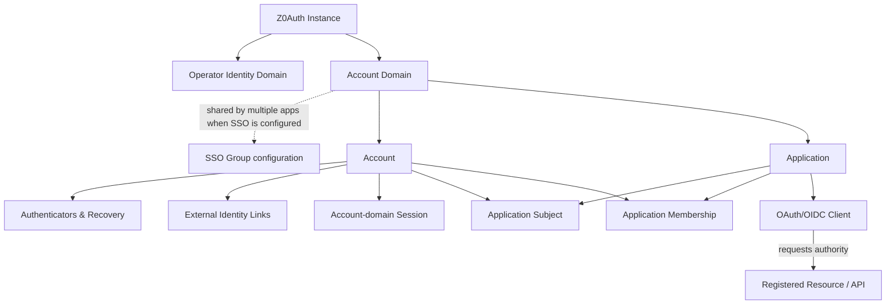
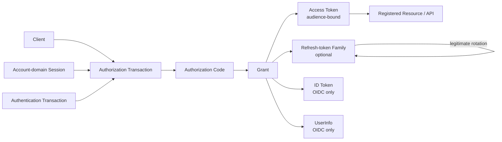

> **Status:** Stable Alpha domain baseline — second audit passed
> **Release:** Alpha
> **Authority:** Derived from the stable Alpha requirements. This document clarifies domain concepts and relationships; it does not override requirements or prescribe database schema, modules, classes, or storage layout.
# 1. Purpose
This document defines the conceptual domain model and shared vocabulary for Z0Auth Alpha. It gives later architecture, protocol, data-model, API, security, and implementation work one consistent meaning for terms such as account domain, application, client, account, subject, session, grant, resource, and principal.
A domain concept may later map to one table, several tables, no table at all, or a derived value. Nothing in this document should be read as a persistence-schema decision unless the stable requirements explicitly make that behavior externally meaningful.
# 2. Conceptual model at a glance
The core structural relationships are:
- Z0Auth Instance
	- Operator Identity Domain
		- Platform Owner
		- Operator Principals
		- Operator Roles and Platform Scopes
	- One or more Account Domains
		- Accounts
		- Account-domain Sessions
		- Applications
			- Application Subjects
			- Application Memberships
			- OAuth/OIDC Clients
		- Authenticators and Recovery State
		- External Identity Links
	- Registered Resources / APIs
	- Signing, audit, lifecycle, and operational state
Protocol relationships are layered onto that model:
- Client requests authorization for a registered Resource and permitted Scopes.
- An Authorization Transaction may establish a Grant.
- A Grant may issue Access Tokens and, when enabled, a Refresh-token Family.
- OIDC grants may issue an ID Token and permit UserInfo.
- A Workload Principal authenticates through a workload client and receives audience-bound access tokens.
An SSO Group is not a second identity layer above an account domain. It is the explicit configuration in which several applications share one account domain.
## 2.1 Conceptual relationship diagram

## 2.2 Relationship and cardinality rules
These are conceptual cardinalities, not database constraints:
- One Z0Auth Instance contains one operator identity domain and zero or more application Account Domains.
- Every Alpha Application belongs to exactly one Account Domain.
- An independent Account Domain serves one independent Application; an SSO-group Account Domain may serve multiple Applications.
- An Application contains one or more OAuth/OIDC Clients over its lifetime.
- An Account belongs to exactly one Account Domain.
- One Account may resolve to separate stable Application Subjects for multiple applications in the same SSO group.
- For a given Account and Application, the Application Subject is stable and singular even when the application has multiple clients.
- Application Membership is optional relative to the Application Subject: subject identity can exist without active membership.
- An Account may have multiple Authentication Methods, External Identity Links, and Sessions.
- A Client may be permitted to request multiple Registered Resources, and a Resource may be reachable by multiple permitted clients. The allowed client-resource-scope relationship constrains issuance.
- A human Grant is associated with one client and its specific subject/resource/scope authority. Workload grants identify a workload principal instead of a human subject.
- Refresh rotation advances one linear family history rather than branching it.
- Operator Principals do not participate in application Account Domains merely because they administer them.
# 3. Foundational boundaries
## 3.1 Z0Auth Instance
A **Z0Auth Instance** is one independently operated deployment and the outermost Alpha trust and configuration boundary.
It contains operator identities, application/account-domain configuration, registered clients and resources, identity/security state, signing state, audit state, and other authoritative Z0Auth data.
Separate instances do not share users, credentials, sessions, configuration, or authoritative state in Alpha. Running applications on the same instance does not itself make those applications share identities.
## 3.2 Operator Identity Domain
The **Operator Identity Domain** is the security domain for the Platform Owner and other console/operator principals.
It is separate from application-user account domains. An operator and an application user may happen to use the same email or username, but that equality does not make them the same principal and does not automatically link them.
Operator authorization includes the special Platform Owner authority plus ordinary Admin, Developer, Viewer/Auditor, and custom scope-based roles.
## 3.3 Account Domain
An **Account Domain** is the boundary inside which end-user identity is shared.
The account domain owns:
- accounts;
- login identifiers;
- passwords and authentication methods;
- external identity links;
- account-level recovery;
- account-domain sessions;
- account lifecycle state;
- account-creation policy.
An independent application has its own account domain. Several applications share an account domain only when they are explicitly configured as an SSO group.
Identity equality is never inferred across account domains from matching email, username, profile data, or external-provider attributes.
## 3.4 Account Creation Policy
An **Account Creation Policy** is the account-domain rule set that determines which account-creation paths are permitted.
Alpha creation paths include open self-signup, invitation-required signup, and operator/admin-created accounts. These paths may be enabled independently or in combination.
External identity providers authenticate identities but do not independently grant account-creation authority. A successfully authenticated unknown external identity may still be denied account creation when the account domain is closed or invitation-only.
## 3.5 SSO Group
An **SSO Group** is an explicit shared-account-domain configuration for multiple applications.
Applications in an SSO group share the same underlying account, authenticators, recovery state, external identity links, and Z0Auth session domain. They do not automatically share application membership, application data, or application authorization.
An SSO group is therefore an identity-sharing boundary, not an application-merging boundary.
For Alpha, an application's account-domain placement becomes immutable once user identities exist. Migration of populated applications into, out of, or between SSO groups is post-Alpha work.
# 4. Application model
## 4.1 Application
An **Application** represents one software product or application-level identity relationship registered with Z0Auth.
The application owns or defines:
- application membership;
- application-specific access decisions;
- application scopes and their application-defined semantics;
- the stable application-facing subject relationship;
- permitted claim-release boundaries;
- its child OAuth/OIDC clients.
An application does not own the account-domain credentials or account-level authentication methods.
## 4.2 OAuth/OIDC Client
A **Client** is a protocol entry point registered beneath an application.
Examples include a server-backed web client, SPA/public client, or backend/workload client. Several clients can represent the same application without creating separate application users or memberships.
A client owns protocol-specific configuration such as:
- client identifier;
- public or confidential security class;
- permitted flows;
- redirect URIs;
- browser origins where applicable;
- client-authentication credentials and methods;
- the subset of application scopes/resources it may request;
- any stronger client-specific assurance requirement.
The client security class is not the application identity boundary.
## 4.3 Registered Resource / API
A **Registered Resource** is an API or resource server for which Z0Auth may issue access tokens.
Each resource has a stable resource identifier used as the token audience. A client must be explicitly permitted to request the resource and the applicable scopes.
A resource server interprets the application-defined meaning of scopes and claims and enforces its own authorization rules. Z0Auth constrains issuance; it does not implement the application's domain authorization.
## 4.4 Scope
A **Scope** is a named unit of authority exposed by an application/resource vocabulary.
Z0Auth knows whether a client may request and receive a scope, but does not assign application-specific meaning to that scope.
The application defines the available scope vocabulary. A child client may be restricted to a subset. A concrete grant contains only the permitted scopes actually requested and granted.
## 4.5 Claim
A **Claim** is an identity or authentication-context value that Z0Auth may release to a client or resource when permitted.
Claim exposure is bounded by configured policy and the applicable protocol/grant. Sharing an account through SSO does not give every application unrestricted access to all account data.
Mutable profile information should not be confused with stable subject identity.
# 5. End-user identity model
## 5.1 Account
An **Account** is the durable end-user identity inside one account domain.
The same real-world person may have unrelated accounts in multiple independent account domains. Z0Auth does not attempt to create one global person record across those domains.
The account owns its authentication methods, recovery state, external identity links, lifecycle, and account-domain sessions.
Email and username are mutable login identifiers/attributes of the account, not the durable account identity.
## 5.2 Application Subject
An **Application Subject** is the stable identifier through which an application recognizes an authenticated account.
It is distinct from:
- the internal Z0Auth account identifier;
- mutable email/username values;
- application membership;
- an OAuth/OIDC client.
Several clients belonging to the same application resolve the same account to the same application-level subject. Different applications may receive different application-facing subjects even when they share one SSO account.
A subject may be established or derivable for protocol identity without implying that the application has accepted the user as a member.
## 5.3 Application Membership
**Application Membership** is the relationship stating that an account/application-subject is accepted as a member/user of a particular application.
Authentication and membership are intentionally separate:
- Z0Auth may authenticate an account successfully without the application granting membership;
- membership deletion does not delete a shared SSO account;
- removing membership does not destroy the stable application subject;
- rejoining with the same account normally reconnects to the same subject.
Application access suspension is likewise application-owned authorization state and is separate from Z0Auth account suspension.
## 5.4 Login Identifier
A **Login Identifier** is a user-facing value used to locate an account during authentication, such as email or username.
Login-identifier uniqueness is scoped to an account domain. Login identifiers are mutable and must never be treated as durable subject keys.
## 5.5 Application-defined Metadata
**Application-defined Metadata** is opaque application context associated with an application subject.
It remains semantically owned by the application, is isolated from other applications, and does not become shared account profile data merely because the application participates in SSO. Z0Auth does not use arbitrary application metadata as application authorization policy.
# 6. Authentication model
## 6.1 Authentication Method and Authenticator
An **Authentication Method** is a mechanism by which an account proves control or identity. An enrolled concrete method is an **Authenticator**.
Alpha methods include password, passkey/WebAuthn, TOTP, magic-link/email authentication, and linked external identity providers according to their specific semantics.
Authenticators belong to the account domain, not an individual application. Applications request an assurance outcome rather than taking ownership of the user's authenticators.
Accounts may have multiple independently manageable authenticators where the method supports it.
## 6.2 Recovery Mechanism
A **Recovery Mechanism** is a credential or process used to regain the ability to authenticate or replace a lost authentication factor.
Recovery codes are recovery mechanisms, not MFA authenticators. Password-reset credentials and recovery capabilities authorize only their specific recovery purpose and are not ordinary authenticated sessions.
## 6.3 External Identity Link
An **External Identity Link** associates a Z0Auth account with an upstream identity provider identity.
The durable upstream key is the provider issuer plus subject pair. Provider email is an attribute, not the permanent identity key.
The link belongs to one account domain. Linking never crosses account-domain boundaries automatically. Unlinking removes that authentication relationship without deleting unrelated account methods or otherwise-valid sessions.
## 6.4 External Identity Provider Configuration
An **External Identity Provider Configuration** is the Z0Auth configuration that describes how Z0Auth communicates with and trusts a specific upstream identity authority.
A configuration includes the provider issuer and the protocol metadata/credentials needed for discovery, authorization, token validation, and profile acquisition. The issuer is the identity-authority boundary: changing endpoints or client credentials while retaining the same issuer does not change established identity links, while changing issuer represents a different identity authority.
Disabling or removing a provider configuration stops use of that integration but does not erase established external identity-link history.
A provider configuration may be trusted for specific verified-email linking behavior only through explicit opt-in policy; provider authentication by itself is not authority to cross account-domain boundaries or create accounts where account-creation policy forbids it.
## 6.5 Authentication Transaction
An **Authentication Transaction** is bounded server-side security state for one authentication, verification, recovery, enrollment, or step-up ceremony.
It binds the relevant account domain, intended action, freshness/assurance context, one-time credentials, and continuation state needed to complete or safely abandon that ceremony.
An OAuth/OIDC Authorization Transaction may invoke or wait on an Authentication Transaction, but the concepts are distinct: the authorization transaction represents a protocol request from a client, while the authentication transaction represents Z0Auth's identity-verification ceremony.
Magic links and similar one-time credentials may be bound to a pending Authentication Transaction so they cannot be replayed as generic login authority.
## 6.6 Assurance
**Assurance** describes what level of authentication has been successfully established.
Alpha deliberately keeps the vocabulary small:
- baseline authenticated;
- MFA/additional verification satisfied.
Applications request required assurance. A child client may require stronger assurance than its parent application baseline, but may not weaken it.
Assurance on an existing session is historical evidence of authentication that already occurred. Removing an authenticator later does not retroactively erase assurance the session already earned.
# 7. Session model
## 7.1 Account-domain Session
A **Session** is Z0Auth's server-recognized authenticated continuity for an account within one account domain.
Independent applications therefore have independent session domains. Applications in one SSO group share the account-domain SSO session.
A session is separate from OAuth access tokens and application-local sessions.
A long-lived Z0Auth session can allow a relying application to establish a new local session through a normal OIDC round trip without prompting for credentials again when assurance/freshness remains sufficient.
## 7.2 Browser Session Credential
A **Browser Session Credential** is the browser-held bearer credential used to reference a logical Z0Auth session.
It is not the session itself. The credential is rotated when anonymous/pre-authentication state becomes authenticated and when a material assurance upgrade occurs.
This distinction allows logical session continuity while preventing an old browser credential from inheriting newly established authority.
## 7.3 Application-local Session
An **Application-local Session** is session state owned by a relying application after Z0Auth authentication.
It is outside the Z0Auth account-domain session even though the two may be correlated for logout. Its lifetime may be shorter than the upstream Z0Auth session.
# 8. OAuth/OIDC authorization model
## 8.1 Authorization and token relationship diagram

## 8.2 Authorization Transaction
An **Authorization Transaction** is the bounded server-side state for one authorization request.
It freezes the security-relevant request context such as client, validated redirect URI, requested scopes, PKCE challenge, application/account domain, resource selection, and OIDC request values.
Parallel transactions are isolated. Completing, cancelling, or expiring one transaction does not rewrite another transaction's protocol parameters.
## 8.3 Authorization Code
An **Authorization Code** is a short-lived, single-use credential produced by a successfully completed authorization transaction and redeemed at the token endpoint.
It is bound to the client, redirect URI, PKCE context, and transaction. It is not an access token or session.
## 8.4 Grant
A **Grant** is the server-side authorization relationship established by one successful authorization.
Conceptually, a grant binds:
- client;
- human principal/application subject when applicable;
- target resource/audience;
- granted scopes;
- renewable authority when refresh capability exists.
Separate authorization requests create specific grants; authority does not silently accumulate across requests.
Alpha grant state supports protocol continuity but is not a persistent end-user consent record.
## 8.5 Access Token
An **Access Token** is a short-lived, self-contained JWT bearer credential issued for a specific registered resource audience.
It carries the authority needed by the target resource server and is validated locally using Z0Auth's published signing keys.
An access token is distinct from the browser session, the grant, the refresh token, and the ID Token.
Revoking upstream Z0Auth state stops future issuance but does not ordinarily make every already-issued self-contained access token disappear before its expiry.
## 8.6 Refresh-token Family
A **Refresh-token Family** is the server-side renewable credential lineage associated with a client/grant.
Individual refresh tokens are opaque high-entropy credentials. Legitimate use rotates the token while retaining one linear family history.
The family tracks replay/revocation and lifetime state. Replay containment is scoped first to the affected family/grant instead of automatically destroying unrelated SSO state.
## 8.7 ID Token
An **ID Token** is an OIDC client-bound authentication assertion describing an authenticated subject and relevant authentication context.
It is not an API access credential.
## 8.8 UserInfo
**UserInfo** is the OIDC profile/claim retrieval surface for an OIDC grant.
It returns the same stable subject relationship as the corresponding ID Token and only the claims currently permitted for that client/grant. It is preferred over overloading access tokens with mutable profile data.
# 9. Workload model
## 9.1 Workload Principal
A **Workload Principal** is a non-human principal authenticated for machine-to-machine access.
Alpha supports workload authentication through Client Credentials. A workload authenticates as a workload, never as a fabricated human user.
The resulting access token uses a workload/client principal as its subject and is constrained to registered resources/scopes.
Human-on-behalf-of delegation is not an Alpha concept. Future token exchange/OBO will require an explicit distinction between human subject and workload actor.
## 9.2 Client Credential
A **Client Credential** is authentication material used by a confidential client to authenticate itself to Z0Auth.
Alpha supports client secrets and the configured token-endpoint authentication methods. A client secret proves the client; it is not an API access token presented directly to ordinary application resource servers.
## 9.3 Client Secret
A **Client Secret** is one concrete confidential-client credential managed beneath a client.
A confidential client may hold multiple concurrently valid client secrets to support deliberate rotation. Each secret has its own lifecycle metadata and can be revoked independently. The plaintext value is shown only at creation and is not later retrievable.
# 10. Administrative model
## 10.1 Operator Principal
An **Operator Principal** is an authenticated identity in the operator identity domain that is permitted to use Z0Auth administration capabilities.
Operator principals are separate from application-user accounts.
## 10.2 Platform Owner
The **Platform Owner** is the unique instance ownership authority.
There is exactly one active Platform Owner. Ownership is not an ordinary RBAC role and cannot be granted through normal role assignment.
The Platform Owner also has normal administrative authority, while ownership transfer and recovery remain special high-assurance operations.
## 10.3 Operator Role and Platform Scope
An **Operator Role** groups administrative permissions for an operator principal.
Alpha provides Admin, Developer, Viewer/Auditor, and custom roles composed from explicit **Platform Scopes**. Platform scopes are administrative permissions and must not be confused with OAuth resource scopes issued to application clients.
# 11. Lifecycle and security records
## 11.1 Account Lifecycle State
The Alpha account lifecycle states are:
- **Active** — authentication is permitted subject to normal policy.
- **Suspended** — account authentication and renewable authority are contained but the account remains recoverable.
- **Pending Deletion** — the account is scheduled for purge and may be restored during the configured grace period.
- **Purged** — the identity is no longer authenticatable or recoverable.
A UI label such as disabled may represent indefinite suspension but is not a separate persisted lifecycle state.
## 11.2 Lifecycle Event
A **Lifecycle Event** is a durable ordered notification about identity lifecycle changes that consuming applications may reconcile from the Z0Auth lifecycle feed.
Consumers maintain their own cursor/checkpoint and process at least once. The event stream communicates Z0Auth identity lifecycle; it does not perform application-owned data deletion.
## 11.3 Lifecycle Consumer and Checkpoint
A **Lifecycle Consumer** is an application-side logical consumer of the Z0Auth identity lifecycle feed.
A **Consumer Checkpoint** is that consumer's durable position/cursor in the ordered lifecycle stream. Delivery is at least once, so consumers own deduplication, idempotent processing, retry, and dead-letter behavior.
An authorized operator may deliberately and auditably move a checkpoint after resolving or explicitly accepting a processing failure.
## 11.4 Signing Key
A **Signing Key** is issuer-controlled asymmetric key material used by Z0Auth to sign JWT access tokens and ID Tokens.
The private signing material is protected and never published. Its public verification material is exposed through JWKS together with a key identifier so clients and resource servers can select the correct verification key.
Z0Auth may publish multiple verification keys during planned rotation. Emergency retirement of a compromised signing key may intentionally invalidate otherwise-unexpired tokens signed by that key.
## 11.5 Audit Event
An **Audit Event** is an append-only structured security or administrative fact recorded by Z0Auth.
Audit state is different from ordinary diagnostic/operational logs. It records security-sensitive successes and failures using minimized safe context and never contains plaintext credentials or bearer secrets.
# 12. Relationship invariants
The following relationships are foundational and should remain true through architecture and implementation:
1. **Instance does not imply identity sharing.** Applications share identity only through an explicit shared account domain / SSO group.
2. **Account domain owns authentication identity.** Applications own membership and application authorization.
3. **Account is not a global person record.** The same person may have independent accounts in independent account domains.
4. **Subject is not membership.** An application-facing subject can exist independently of whether the application currently grants membership.
5. **Application is not client.** Several protocol clients can represent one application and one application-level user identity.
6. **Client is not resource.** A client requests authority; a registered resource receives and validates audience-bound authority.
7. **Scope semantics belong to the application/resource.** Z0Auth controls issuance but does not invent application permission meaning.
8. **Session is not token.** A session represents authentication continuity; access tokens represent short-lived authority already issued.
9. **Grant is not consent.** Alpha maintains server-side grant state without claiming a persistent user-consent model.
10. **ID Token is not Access Token.** ID Tokens authenticate a subject to a client; access tokens authorize requests to registered resources.
11. **External email is not external identity.** External identity continuity follows issuer plus subject.
12. **Recovery is not authentication assurance by itself.** Recovery mechanisms restore access/factors according to their specific rules.
13. **Operator identity is not application identity.** Administrative principals remain in a separate security domain.
14. **Workload is not human.** Machine principals never impersonate human identity merely because both can receive access tokens.
# 13. Glossary
<table fit-page-width="true" header-row="true">
<tr>
<td>Term</td>
<td>Definition</td>
</tr>
<tr>
<td>Account</td>
<td>Durable end-user identity inside one account domain.</td>
</tr>
<tr>
<td>Account Creation Policy</td>
<td>Account-domain rules that determine which account-creation paths are permitted.</td>
</tr>
<tr>
<td>Audience</td>
<td>Registered resource identifier for which an access token is intended and against which the resource server validates the token.</td>
</tr>
<tr>
<td>Account Domain</td>
<td>Boundary within which accounts, credentials, recovery, external links, sessions, lifecycle, and account-creation policy are shared.</td>
</tr>
<tr>
<td>Application</td>
<td>Registered software product/application identity relationship that owns membership, application subject semantics, application scopes, and child clients.</td>
</tr>
<tr>
<td>Application Membership</td>
<td>Application-owned relationship stating that an authenticated subject is accepted as a user/member of that application.</td>
</tr>
<tr>
<td>Application Subject</td>
<td>Stable application-facing identifier for an account, distinct from mutable login identifiers and membership.</td>
</tr>
<tr>
<td>Application-defined Metadata</td>
<td>Opaque application-owned metadata namespaced to an application subject and isolated from other applications.</td>
</tr>
<tr>
<td>Assurance</td>
<td>Result describing the level of authentication successfully established.</td>
</tr>
<tr>
<td>Audit Event</td>
<td>Append-only structured security or administrative fact.</td>
</tr>
<tr>
<td>Authenticator</td>
<td>Concrete enrolled authentication method associated with an account.</td>
</tr>
<tr>
<td>Authorization Code</td>
<td>Short-lived single-use credential used to complete Authorization Code exchange.</td>
</tr>
<tr>
<td>Authorization Transaction</td>
<td>Bounded server-side state for one OAuth/OIDC authorization request.</td>
</tr>
<tr>
<td>Authentication Transaction</td>
<td>Bounded server-side state for one authentication, verification, recovery, enrollment, or step-up ceremony.</td>
</tr>
<tr>
<td>Browser Session Credential</td>
<td>Browser-held bearer value that references a logical Z0Auth account-domain session.</td>
</tr>
<tr>
<td>Claim</td>
<td>Permitted identity or authentication-context value released through a protocol surface.</td>
</tr>
<tr>
<td>Credential</td>
<td>Secret, key, code, token, or other protected value whose possession or successful verification establishes a specific capability or proof. Its meaning depends on the concrete credential type.</td>
</tr>
<tr>
<td>Client</td>
<td>OAuth/OIDC protocol entry point registered beneath an application.</td>
</tr>
<tr>
<td>Client Credential</td>
<td>Secret or other credential used by a confidential client to authenticate itself to Z0Auth.</td>
</tr>
<tr>
<td>Client Secret</td>
<td>One concrete confidential-client secret credential with independent lifecycle and rotation state.</td>
</tr>
<tr>
<td>External Identity Link</td>
<td>Relationship between a local account and an upstream identity identified by issuer plus subject.</td>
</tr>
<tr>
<td>External Identity Provider Configuration</td>
<td>Configuration describing how Z0Auth communicates with and trusts a specific upstream identity authority.</td>
</tr>
<tr>
<td>Grant</td>
<td>Server-side authorization relationship for a specific client, principal, resource, and granted authority.</td>
</tr>
<tr>
<td>Human Principal</td>
<td>Authenticated end-user identity represented through the relevant account/application-subject context.</td>
</tr>
<tr>
<td>ID Token</td>
<td>OIDC authentication assertion issued to a client; not an API credential.</td>
</tr>
<tr>
<td>Issuer</td>
<td>Canonical identifier of the authorization or identity authority that created a token or identity assertion. For external identities, issuer plus subject forms the durable upstream identity key.</td>
</tr>
<tr>
<td>Instance</td>
<td>One independently operated Z0Auth deployment and outer Alpha configuration/trust boundary.</td>
</tr>
<tr>
<td>Lifecycle Event</td>
<td>Durable ordered identity-lifecycle notification exposed to consuming applications.</td>
</tr>
<tr>
<td>Lifecycle Consumer</td>
<td>Application-side logical consumer of the identity lifecycle feed.</td>
</tr>
<tr>
<td>Consumer Checkpoint</td>
<td>Durable cursor recording a lifecycle consumer's position in the ordered feed.</td>
</tr>
<tr>
<td>Login Identifier</td>
<td>Mutable value such as email or username used to locate an account during authentication.</td>
</tr>
<tr>
<td>Operator Principal</td>
<td>Authenticated identity in the separate operator/console security domain.</td>
</tr>
<tr>
<td>Operator Role</td>
<td>Named grouping of administrative platform permissions.</td>
</tr>
<tr>
<td>Platform Owner</td>
<td>Unique instance ownership authority, separate from ordinary RBAC roles.</td>
</tr>
<tr>
<td>Platform Scope</td>
<td>Administrative permission used for operator authorization; distinct from OAuth application scopes.</td>
</tr>
<tr>
<td>Principal</td>
<td>An identity Z0Auth recognizes as an actor in a security context. Human, workload, and operator principals remain distinct principal categories.</td>
</tr>
<tr>
<td>Recovery Mechanism</td>
<td>Credential or process used to regain authentication capability or replace lost factors.</td>
</tr>
<tr>
<td>Refresh-token Family</td>
<td>Server-side renewable token lineage associated with a grant/client and its replay/lifetime state.</td>
</tr>
<tr>
<td>Registered Resource</td>
<td>API/resource server with a stable identifier used as an access-token audience.</td>
</tr>
<tr>
<td>Scope</td>
<td>Application/resource-defined unit of authority that Z0Auth may issue when permitted.</td>
</tr>
<tr>
<td>Signing Key</td>
<td>Issuer-controlled asymmetric key material used to sign Z0Auth JWTs; only public verification material is published.</td>
</tr>
<tr>
<td>JWKS</td>
<td>Published JSON Web Key Set containing public verification material for Z0Auth signing keys.</td>
</tr>
<tr>
<td>Session</td>
<td>Z0Auth authenticated continuity for an account within one account domain.</td>
</tr>
<tr>
<td>SSO Group</td>
<td>Explicit configuration in which several applications share one account domain.</td>
</tr>
<tr>
<td>UserInfo</td>
<td>OIDC profile/claim retrieval surface for an OIDC grant.</td>
</tr>
<tr>
<td>Workload Principal</td>
<td>Non-human principal authenticated for machine-to-machine access.</td>
</tr>
</table>
# 14. Concepts intentionally not modeled as Alpha domain entities
The following should not be accidentally promoted into Alpha core concepts:
- a global person identity spanning independent account domains;
- a built-in organization/tenant entity;
- persistent end-user OAuth consent or Connected Apps records;
- a generic developer PAT/API-key identity owned by Z0Auth;
- human-on-behalf-of delegation chains;
- cross-instance identity/federation relationships;
- populated-account-domain migration entities;
- adaptive-risk/device-trust classifications.
They may become explicit concepts in later releases when corresponding requirements exist.
# 15. Source and authority
This domain model is derived from the stable Alpha requirements baseline. See the public [Alpha roadmap](../overview/alpha.md) for the release-level scope.
Where this document appears to conflict with the stable requirements, the requirements document wins and this artifact must be corrected. Historical simulation notes remain decision rationale, not an alternate domain model.