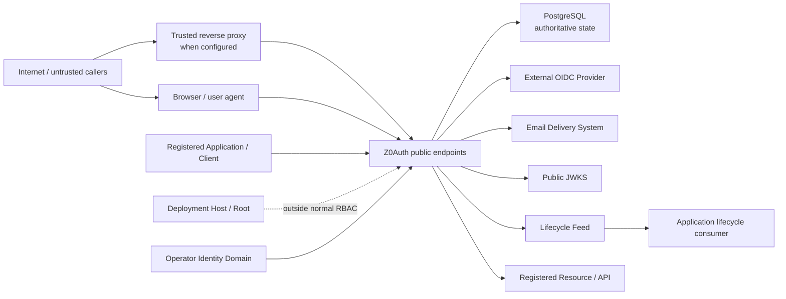
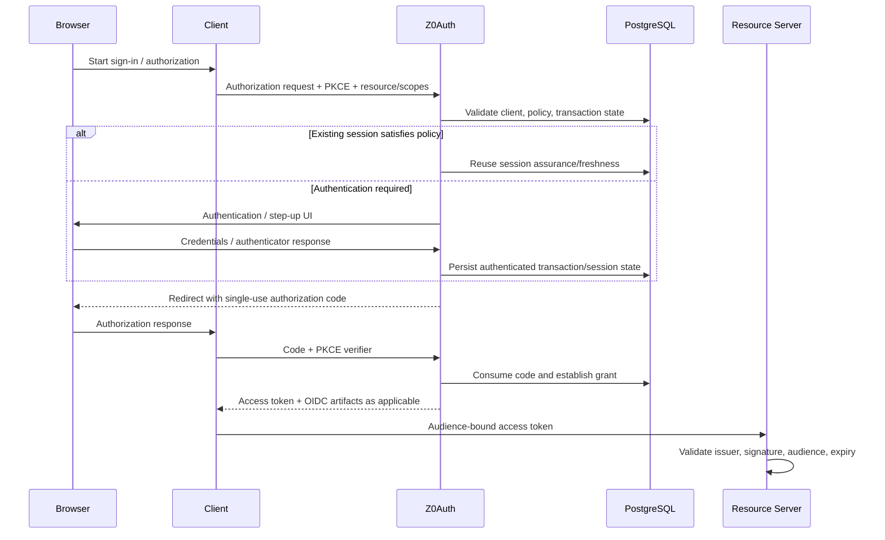
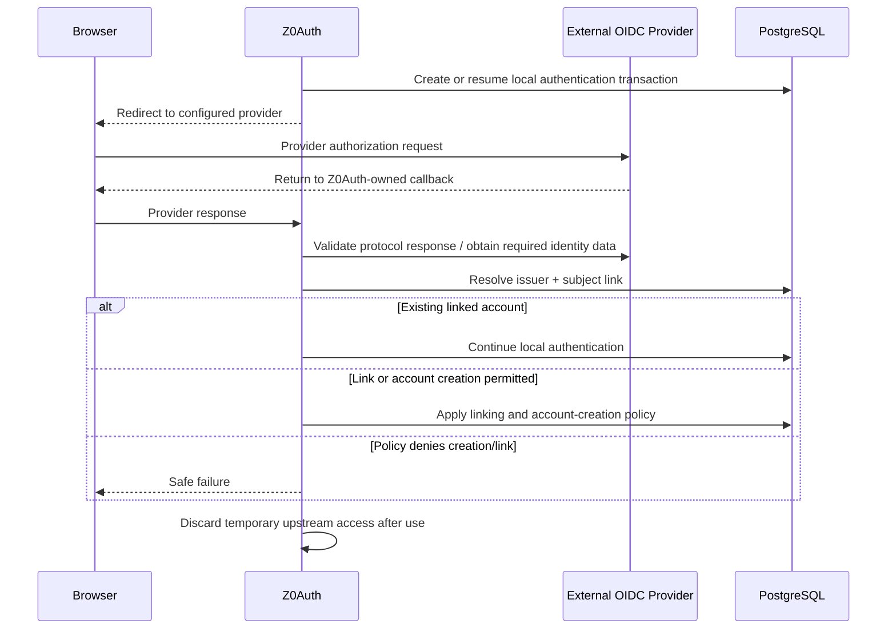

> **Status:** Stable Alpha threat-model baseline — audit passed
> **Release:** Alpha
> **Authority:** Derived from the stable Alpha requirements and the stable Domain Model and Glossary. This document identifies actors, trust boundaries, protected assets, threat scenarios, and required security properties. It does not replace detailed protocol specifications, deployment hardening guidance, or implementation-level security review.
# 1. Purpose and scope
This document establishes the security model for Z0Auth Alpha before architecture is finalized.
It answers four questions:
1. Who interacts with or operates Z0Auth?
2. Which boundaries separate different levels of trust or authority?
3. Which assets and security properties must be protected?
4. What threat scenarios must later architecture, protocol, data-model, operational, and testing work explicitly address?
The model is intentionally system-level. It does not assume a particular module graph, table layout, process topology, cryptographic library, reverse-proxy product, or deployment platform.
# 2. Security objectives
The Alpha security model is built around the following objectives.
## 2.1 Identity authenticity
Z0Auth must not allow one principal to be mistaken for another through mutable identifiers, external-provider ambiguity, session confusion, credential replay, account-linking errors, or operator/application identity crossover.
## 2.2 Authority containment
A credential, token, session, grant, client, workload, operator, or application must not gain authority outside the boundary explicitly assigned to it.
This includes:
- account-domain isolation;
- client/resource/scope restrictions;
- application membership separation;
- operator-role boundaries;
- workload/human separation;
- audience-specific access tokens;
- grant and refresh-family containment.
## 2.3 Protocol integrity
OAuth/OIDC security-relevant parameters and transaction state must remain bound to the request that established them.
Z0Auth must reject malformed, replayed, mismatched, downgraded, or attacker-substituted protocol input rather than repairing it into a different security meaning.
## 2.4 Credential and secret protection
Passwords, client secrets, refresh tokens, recovery codes, bearer tokens, private signing material, MFA secrets, recovery capabilities, and equivalent credentials must be protected according to their purpose and never exposed through ordinary logs or audit records.
## 2.5 Revocation and bounded staleness
Revocation must reliably stop future renewable authority within the documented boundary.
Already-issued self-contained access tokens may remain valid until expiry unless a resource server has an independent reason to reject them. The system therefore relies on intentionally short access-token lifetimes rather than pretending to provide universal instantaneous revocation.
## 2.6 Auditability
Security-sensitive state changes and failures must leave structured evidence sufficient for investigation without turning the audit trail into a secret or personal-data dump.
## 2.7 Recoverability without authority resurrection
Restart, retry, restore, recovery, migration, and concurrent execution must not accidentally recreate consumed credentials, lost revocations, duplicate authority, or previously terminated security state.
## 2.8 Availability with safe failure
When authoritative dependencies are unavailable, Z0Auth must fail closed for operations that require authoritative state while allowing already-issued locally verifiable access tokens to continue according to their normal validity at resource servers.
# 3. Actors and external systems
## 3.1 Platform Owner
The **Platform Owner** is the unique instance ownership authority.
Security significance:
- can exercise ordinary Admin authority;
- can transfer ownership;
- is the target of host-controlled break-glass recovery;
- must use MFA-grade authentication;
- requires fresh privileged verification for high-impact actions.
The Platform Owner is trusted to administer the instance but is still subject to authentication, confirmation, audit, and concurrency safeguards.
## 3.2 Admin operator
An **Admin** is a privileged operator with broad ordinary administrative authority.
Admins can manage ordinary members and other Admins within the documented safeguards but cannot replace, recover, demote, or supersede the Platform Owner.
An Admin is trusted for authorized administrative actions but must not be treated as equivalent to deployment-root authority or ownership authority.
## 3.3 Developer operator
A **Developer operator** manages application-facing configuration allowed by its platform permissions, such as applications, clients, resources, and related integration configuration.
A Developer must not gain broader operator authority merely because application configuration can influence protocol behavior.
## 3.4 Viewer / Auditor
A **Viewer/Auditor** is a read-only operator for permitted administrative and audit information.
Read access remains security-sensitive because configuration, identity metadata, and audit context may contain operational or personal information even when secret values are excluded.
## 3.5 End user
An **End user** is a human principal authenticating within one application account domain or shared SSO account domain.
The end user is trusted only for actions authorized by their current authentication state and policy. User-controlled input is untrusted data.
## 3.6 Application developer / application operator
The **Application developer/operator** configures a relying application, its OAuth/OIDC clients, resources, scopes, redirect URIs, browser origins, and claim permissions.
The application side is outside Z0Auth's internal trust boundary. Z0Auth must validate protocol input even when the application is registered.
## 3.7 OAuth/OIDC Client
A **Client** is a registered protocol actor.
A public client cannot keep a durable client secret. A confidential client may authenticate with configured client credentials. Registration does not make arbitrary client input trusted.
## 3.8 Resource Server
A **Resource Server** receives audience-bound access tokens and validates them locally.
Z0Auth trusts the resource server to enforce its own authorization semantics correctly. The resource server must not assume an access token for another audience is valid authority for itself.
## 3.9 Workload Principal
A **Workload Principal** is a non-human machine principal authenticated through a workload client.
It must never silently acquire a human subject identity. Client Credentials represents workload authority only in Alpha.
## 3.10 External Identity Provider
An **External Identity Provider** is an upstream identity authority such as Google, Microsoft, GitHub, or a configured generic OIDC issuer.
Z0Auth trusts only the configured issuer and protocol-validated assertions. It does not treat provider email alone as a permanent identity key or account-creation authority.
## 3.11 Email delivery system
The **Email delivery system** carries verification, recovery, and magic-link messages.
It is an external dependency and a security-sensitive delivery channel, but successful queuing alone does not mean the security action succeeded.
## 3.12 Reverse proxy / load balancer
A **Reverse proxy** may terminate or forward production traffic.
Forwarded scheme, host, client-address, or origin-related metadata is trusted only when the proxy trust boundary is explicitly configured. Arbitrary forwarding headers from the public internet are untrusted.
## 3.13 PostgreSQL
**PostgreSQL** is the Alpha authoritative production database dependency.
It stores security-critical state that must survive process restart and coordinate replicas. Database availability and correctness are therefore part of Z0Auth readiness and authoritative-operation safety.
## 3.14 Deployment host / infrastructure operator
The **Deployment host or infrastructure operator** controls compute, environment, database access, volumes, network policy, TLS placement, and deployment secrets.
Host/root control is outside Z0Auth's application-level privilege model and can exercise the documented Platform Owner break-glass recovery path. Compromise of this boundary can exceed what application-layer controls can contain.
## 3.15 User agent / browser
The **Browser** executes untrusted web content, stores Z0Auth browser session credentials, follows redirects, invokes WebAuthn, and interacts with application and Z0Auth origins.
Browser state and navigation must be treated as attacker-influenceable. Security depends on origin, cookie, CSRF, redirect, CSP/frame, referrer, and transaction controls rather than trusting browser input.
# 4. Threat-actor classes
The model considers threats from:
- an unauthenticated internet attacker;
- a malicious or compromised end-user browser context;
- a malicious registered client;
- a compromised confidential client;
- a compromised resource server;
- a malicious or compromised application operator;
- a compromised ordinary operator account;
- a compromised Platform Owner account;
- a compromised external identity provider or provider account;
- an attacker controlling DNS/network paths not protected by correctly configured TLS;
- an attacker able to inject spoofed reverse-proxy headers;
- an attacker able to influence external discovery/JWKS URLs;
- an attacker with stolen bearer, refresh, recovery, MFA, or client credentials;
- concurrent requests exploiting race conditions;
- accidental operator actions that weaken or resurrect security state;
- failures or rollback of authoritative infrastructure.
Host/root compromise is recognized as a special boundary: it can bypass or replace application-layer state and therefore cannot be fully mitigated by Z0Auth itself.
# 5. Protected assets
## 5.1 Identity assets
- account identifiers and subject mappings;
- account-domain boundaries;
- login identifiers and verification state;
- application membership relationships;
- external identity links;
- operator identities and role assignments.
## 5.2 Authentication assets
- password hashes;
- passkey/WebAuthn registrations;
- TOTP secret material;
- recovery-code state;
- email-verification, reset, magic-link, and recovery capabilities;
- authentication transaction state;
- assurance and freshness state.
## 5.3 Session and authorization assets
- account-domain sessions;
- browser session credentials;
- authorization transactions;
- authorization codes;
- grants;
- refresh-token families;
- access-token signing authority;
- ID Token signing authority.
## 5.4 Client and application assets
- client identifiers and security class;
- redirect URI and browser-origin registrations;
- client secrets;
- resource registrations;
- allowed resource/scope relationships;
- claim-release configuration;
- external IdP configuration.
## 5.5 Cryptographic assets
- active and retiring signing private keys;
- signing-key identifiers and public JWKS state;
- protected recoverable private material;
- cryptographic configuration.
## 5.6 Administrative and operational assets
- Platform Owner authority;
- operator roles and platform scopes;
- break-glass recovery capability;
- audit trail;
- lifecycle-feed state and consumer checkpoints;
- configuration and deployment secrets;
- migration/version state;
- backups containing authoritative data and required key/configuration material.
# 6. Trust boundaries
**High-level trust-boundary map**

The diagram shows trust zones, not deployment topology. Arrows indicate security-relevant communication, not necessarily direct network connections.
## 6.1 Public network boundary
**Outside:** internet users, registered clients, browsers, attackers.
**Inside:** Z0Auth public protocol and authentication endpoints.
Security consequence: every incoming request remains untrusted until protocol, origin, credential, rate-limit, and authorization checks succeed.
## 6.2 Reverse-proxy trust boundary
**Outside:** arbitrary client-supplied forwarding headers.
**Trusted side:** explicitly configured reverse proxies/load balancers.
Security consequence: issuer calculation, secure-cookie behavior, redirect behavior, WebAuthn origin, and request-origin interpretation cannot depend on forwarding metadata from untrusted sources.
## 6.3 Browser-origin boundary
Z0Auth authentication pages, application origins, upstream IdP origins, and unrelated third-party origins are separate trust zones.
Security consequence:
- authentication pages remain top-level and non-embeddable;
- state-changing cookie-authenticated actions require CSRF protection;
- dynamic security pages avoid referrer leakage and caching;
- Z0Auth auth pages do not load arbitrary third-party resources;
- SPA token access is limited to explicitly registered origins.
## 6.4 Operator-console boundary
The operator identity domain is distinct from application-user account domains.
Security consequence: sharing an email or username must never merge operator and application-user identity, and application authentication must not grant console authority.
## 6.5 Account-domain boundary
Each account domain is an identity/security isolation boundary.
Security consequence:
- login uniqueness is domain-local;
- credentials and sessions do not cross independent domains;
- external links do not auto-link across domains;
- suspension/deletion of one independent domain does not affect another;
- SSO sharing occurs only by explicit configuration.
## 6.6 Application boundary inside an SSO group
Applications may share an account domain while retaining separate membership, application data, subjects, and authorization.
Security consequence: authentication to a shared SSO account must not imply membership or data access in every member application.
## 6.7 Client boundary
Each OAuth/OIDC client has its own protocol configuration and authority ceiling.
Security consequence: one client must not use another client's redirect URI, secret, grant, refresh family, resource permission, or stronger/weaker security class.
## 6.8 Resource / audience boundary
A registered resource is a token audience boundary.
Security consequence: a token issued for one resource is not authority for an unrelated resource, even when both are reachable by the same application or client.
## 6.9 Z0Auth / PostgreSQL boundary
Z0Auth depends on PostgreSQL as authoritative persistent state.
Security consequence:
- stateful issuance and security transitions fail closed when authoritative persistence is unavailable;
- security-critical state is not process-memory-only;
- migrations, restore, concurrency, uniqueness, and transaction semantics can affect security.
## 6.10 Signing-key boundary
Private signing material is a higher-sensitivity boundary than published JWKS verification material.
Security consequence: public verification keys may be broadly distributed; private signing keys must remain protected and usable only for intended issuer signing operations.
## 6.11 External IdP boundary
The external provider is a separate identity authority connected through OIDC.
Security consequence: Z0Auth accepts only protocol-validated assertions from the configured issuer, requests only needed upstream permissions, and does not turn ordinary external login into delegated upstream API authority.
## 6.12 Email-channel boundary
Email is an external delivery channel for selected one-time security credentials.
Security consequence: email possession can satisfy only the specific assurance/recovery meaning assigned to the delivered credential. Password-reset links, verification links, and magic links are not interchangeable authority.
## 6.13 Lifecycle-feed boundary
Z0Auth emits identity lifecycle facts; consuming applications own their downstream processing and data.
Security consequence: at-least-once delivery requires consumer idempotency and checkpoint integrity. Z0Auth does not silently delete application data on behalf of consumers.
## 6.14 Host/deployment boundary
Deployment-root authority sits outside normal Z0Auth RBAC.
Security consequence: host-controlled recovery is deliberately separate from ordinary Admin recovery, and infrastructure protection remains the operator's responsibility.
# 7. High-level security flows
**Human Authorization Code + PKCE flow**

**External identity-provider flow**

## 7.1 Human authorization
1. A client sends an authorization request.
2. Z0Auth validates the client, redirect URI, resource/scope authority, response parameters, and PKCE requirements.
3. Z0Auth creates an authorization transaction.
4. Existing account-domain session state may satisfy authentication and freshness requirements; otherwise an authentication transaction runs.
5. Successful authentication establishes required assurance.
6. Z0Auth completes the authorization transaction and issues a single-use authorization code.
7. The token endpoint validates client/PKCE/code binding and issues protocol artifacts for the permitted grant.
Primary threat surfaces: redirect substitution, request tampering, login CSRF, session fixation, code theft/replay, PKCE downgrade, mix-up, scope/resource escalation, stale transaction reuse.
## 7.2 Refresh
1. A client presents an opaque refresh token.
2. Z0Auth resolves the refresh family and validates client/grant, lifetime, lineage, and revocation state.
3. Legitimate use rotates to one next token.
4. A bounded retry of the immediately previous token is idempotent.
5. Replay outside the allowance revokes the affected family.
Primary threat surfaces: token theft, replay, race conditions, family branching, authority resurrection, cross-client use.
## 7.3 External-provider login
1. Z0Auth creates/resumes a validated local transaction.
2. The browser navigates to the configured provider.
3. The provider returns to the Z0Auth-owned callback.
4. Z0Auth validates issuer, protocol response, signatures, state/nonce semantics, and required identity claims.
5. Z0Auth resolves the issuer-plus-subject link or follows the allowed linking/account-creation rules.
6. Temporary upstream access is discarded after required identity/profile acquisition.
Primary threat surfaces: provider mix-up, issuer confusion, email-based account takeover, callback manipulation, malicious discovery/JWKS, overbroad upstream permissions.
## 7.4 Privileged administration
1. The operator authenticates in the separate operator identity domain.
2. Role/platform-scope checks authorize the requested operation.
3. High-risk operations require fresh MFA-grade step-up and explicit confirmation where required.
4. The state transition is applied atomically and audited.
Primary threat surfaces: privilege escalation, stale privileged sessions, CSRF, compromised operator account, owner takeover, role-race conditions, secret disclosure.
## 7.5 Workload authentication
1. A workload client authenticates to the token endpoint.
2. Z0Auth validates client credentials and allowed resource/scope authority.
3. Z0Auth issues a short-lived audience-bound access token representing the workload principal.
Primary threat surfaces: client-secret theft, credential replay, workload/human confusion, resource/scope escalation.
# 8. Threat catalogue and required responses
## 8.1 Account enumeration
**Threat:** Public authentication, signup, verification, recovery, or magic-link flows reveal whether a particular account exists.
**Required response:** Public responses minimize existence disclosure, while internal security/audit state may retain enough detail for operation and investigation.
## 8.2 Credential stuffing and brute force
**Threat:** Attackers automate password, MFA, recovery, bootstrap, or privileged-authentication attempts.
**Required response:** Rate limiting, throttling/backoff, temporary protections, structured security signals, and no default permanent lockout that can itself be abused for denial of service.
## 8.3 Authentication downgrade
**Threat:** An attacker or client causes Z0Auth to accept weaker authentication than the application/client requires.
**Required response:** Application baseline assurance cannot be weakened by child clients. Security-sensitive configuration and protocol incompatibility fail rather than silently downgrade. Password-only re-entry cannot satisfy privileged step-up.
## 8.4 MFA enrollment takeover
**Threat:** An attacker with only a compromised password attaches a new MFA factor and converts partial account compromise into durable control.
**Required response:** JIT MFA attachment after password authentication requires an additional verified-email challenge before the factor becomes active.
## 8.5 Authenticator-removal abuse
**Threat:** An attacker removes authenticators to lock out the user or weaken future authentication.
**Required response:** Authenticator removal requires fresh verification and cannot remove the last usable normal sign-in method without another verified method.
## 8.6 Recovery abuse
**Threat:** Reset, recovery-code, magic-link, or break-glass credentials are replayed, confused with normal sessions, or used beyond their intended purpose.
**Required response:** Recovery credentials are short-lived or one-time as applicable, purpose-bound, superseded when required, and do not automatically become ordinary authenticated sessions. Recovery-code use results in replacement-factor enrollment.
## 8.7 Login/session fixation
**Threat:** An attacker establishes or predicts a pre-authentication browser credential and causes the victim's authenticated state to attach to it.
**Required response:** Rotate the browser session credential on anonymous-to-authenticated transition and material assurance upgrade. Superseded credentials are invalid for new requests.
## 8.8 Session hijacking
**Threat:** A stolen browser credential is reused to impersonate an authenticated account.
**Required response:** Secure, HttpOnly, host-only cookies; explicit CSRF protection for state changes; idle/absolute policy; user-visible session management; revocation; and bounded account-domain scope.
## 8.9 Cross-site request forgery
**Threat:** A malicious origin triggers state-changing Z0Auth actions using ambient browser credentials.
**Required response:** Explicit CSRF protection for cookie-authenticated state changes. SameSite is defense-in-depth, not the only control.
## 8.10 XSS and hostile embedded content
**Threat:** Injected script or arbitrary third-party content steals credentials, modifies flows, or exfiltrates security context.
**Required response:** Safe handling of user/application-controlled content, no arbitrary third-party resources on authentication surfaces, and top-level non-embeddable authentication/security pages.
## 8.11 Clickjacking / embedded-login abuse
**Threat:** An attacker embeds login or security UI to trick users into unintended actions.
**Required response:** Authentication, MFA, recovery, and protocol-error pages are not arbitrarily frameable; Alpha uses top-level navigation.
## 8.12 Redirect URI substitution and open redirect
**Threat:** Authorization responses or error data are sent to attacker-controlled destinations.
**Required response:** Validate client and exact registered redirect URI before redirecting. Unknown clients or untrusted redirects fail locally.
## 8.13 Authorization-request parameter tampering
**Threat:** A client or attacker injects malformed, duplicated, contradictory, or unsupported security-sensitive OAuth/OIDC parameters.
**Required response:** Strict rejection; no repair, guessing, or silent response-mode/security downgrade.
## 8.14 Authorization transaction substitution
**Threat:** State from one authorization attempt is reused or swapped into another.
**Required response:** Independent server-side authorization transactions freeze client, redirect, PKCE, scopes, resources, account-domain, and other security-relevant request state. Parallel transactions remain isolated.
## 8.15 OAuth mix-up / issuer confusion
**Threat:** A client confuses responses from different authorization servers or an attacker redirects protocol state across issuers.
**Required response:** Canonical issuer identity, authorization-response issuer identification, issuer validation by clients, and metadata derived from canonical public configuration.
## 8.16 Authorization-code theft or replay
**Threat:** A stolen or previously consumed code is redeemed.
**Required response:** Codes are short-lived, single-use, and bound to client, redirect URI, PKCE, and transaction. Replay fails that exchange without automatically revoking unrelated authority.
## 8.17 PKCE downgrade or verifier substitution
**Threat:** A public or confidential interactive client completes code exchange without the originally required proof.
**Required response:** PKCE S256 is mandatory for interactive Authorization Code flows, bound into the authorization transaction, and never silently disabled.
## 8.18 Scope escalation
**Threat:** A client requests or receives authority beyond its configured ceiling or beyond the current grant.
**Required response:** Reject scopes outside the allowed set. Issue only the permitted subset actually requested. Separate grants do not accumulate authority.
## 8.19 Audience/resource confusion
**Threat:** A token intended for one API is accepted by another or a client obtains authority for an unregistered/unauthorized resource.
**Required response:** Resources are registered first-class audiences, client-resource permissions are explicit, unknown/unauthorized resources are rejected, and access tokens are audience-specific.
## 8.20 Access-token theft
**Threat:** A bearer access token is stolen and replayed before expiry.
**Required response:** Alpha uses short-lived bearer access tokens and does not claim sender constraint. Resources validate issuer, audience, signature, and expiry. DPoP/mTLS sender constraint is post-Alpha.
**Residual risk:** A valid stolen bearer token may remain usable until expiry.
## 8.21 Refresh-token theft and replay
**Threat:** A stolen refresh token is reused to extend authority.
**Required response:** Opaque rotating refresh tokens, server-side family lineage, bounded idempotent retry of the immediate predecessor, and replay-triggered containment of the affected family.
## 8.22 Refresh race / lineage branching
**Threat:** Concurrent refresh requests create multiple valid descendants or inconsistent replay state.
**Required response:** Concurrency-safe linear refresh lineage; a grace retry returns the already-current child rather than rotating again.
## 8.23 Client-secret disclosure
**Threat:** A confidential client secret is leaked, logged, redisplayed, or cannot be rotated safely.
**Required response:** One-time plaintext display, independent lifecycle metadata, multiple concurrent secrets for rotation, immediate revocation of compromised secrets, and no plaintext secret logging.
## 8.24 Public-client secret misuse
**Threat:** A SPA/public client is incorrectly treated as confidential because it contains an embedded static secret.
**Required response:** Public clients do not receive a client secret merely to imitate confidential-client authentication.
## 8.25 Workload/human identity confusion
**Threat:** Client Credentials is interpreted as authority for a human user or an application fabricates user identity for machine calls.
**Required response:** Workloads authenticate as workload principals. Human-on-behalf-of delegation is explicitly outside Alpha.
## 8.26 External-provider account takeover by email
**Threat:** An attacker controls an upstream identity with the victim's email or exploits provider email changes to take over a local account.
**Required response:** Durable link identity is issuer plus subject. Verified-email auto-linking is opt-in for explicitly trusted issuers and never crosses account domains. Default linking requires proof of the existing account.
## 8.27 External-provider configuration substitution
**Threat:** Provider endpoints or issuer settings are changed so existing links resolve against a different identity authority.
**Required response:** Issuer defines the identity-authority boundary. Changing issuer creates a distinct authority; retaining issuer while changing connection metadata does not silently relink subjects.
## 8.28 Upstream token over-retention
**Threat:** Ordinary login accidentally turns Z0Auth into a delegated upstream API token store.
**Required response:** Request only authentication/linking permissions, no upstream offline access by default, no ordinary upstream refresh-token retention, and discard temporary upstream access after identity/profile acquisition.
## 8.29 SSRF through OIDC discovery/JWKS
**Threat:** An attacker-controlled provider configuration causes Z0Auth to access arbitrary internal network services.
**Required response:** Outbound discovery/JWKS retrieval uses SSRF-safe defaults. Operators may explicitly allow legitimate internal provider endpoints.
## 8.30 WebAuthn origin/RP confusion
**Threat:** Host-header or reverse-proxy manipulation changes the RP ID or origin accepted by WebAuthn.
**Required response:** Explicit canonical public origin and RP ID, validation against configured values, and no arbitrary Host-derived trust boundary. RP ID changes are explicit security-sensitive migrations.
## 8.31 Signing-key theft
**Threat:** An attacker obtains the active signing private key and forges valid tokens.
**Required response:** Protected private material, public-only JWKS, deliberate rotation, and immediate retirement/replacement on suspected compromise.
**Residual effect:** Emergency key removal may invalidate otherwise-unexpired tokens; that is accepted containment behavior.
## 8.32 Algorithm confusion
**Threat:** A verifier or issuer accepts an unintended, symmetric, unsigned, or downgraded JWT algorithm.
**Required response:** Alpha uses an explicit RS256 allowlist; symmetric issuer signing and alg=none are unsupported.
## 8.33 JWKS staleness and unknown-key abuse
**Threat:** Verifiers keep compromised keys too long or attackers trigger excessive refreshes using unknown key IDs.
**Required response:** Bounded configurable cache, efficient revalidation, periodic refresh, and immediate but rate-limited refresh on unknown key identifiers.
## 8.34 Operator privilege escalation
**Threat:** An operator assigns themselves ownership or broader privileges outside their role.
**Required response:** Platform Owner is not an ordinary role; ordinary roles cannot imply it; role changes follow scope checks, privileged verification, confirmation, audit, concurrency safeguards, and ownership-specific rules.
## 8.35 Platform Owner takeover
**Threat:** Admin recovery or role manipulation replaces the unique owner.
**Required response:** Ordinary Admins cannot reset, recover, demote, or supersede the Platform Owner. Ownership transfer requires the current owner and strong fresh authentication. Host recovery is a separate break-glass boundary.
## 8.36 Break-glass abuse
**Threat:** Deployment-level recovery becomes a permanent bypass or second owner.
**Required response:** Host-controlled recovery is disabled by default, short-lived, one-time, auditable, and restores access to the unique ownership authority rather than creating parallel ownership.
## 8.37 Audit tampering
**Threat:** A privileged operator edits or selectively erases evidence of security actions.
**Required response:** Audit trail is append-only through the Z0Auth application. Retention is policy-driven rather than arbitrary selective deletion.
## 8.38 Secret leakage through logs/audit/metrics
**Threat:** Credentials or sensitive personal identifiers are exposed through diagnostics.
**Required response:** Explicit prohibition on logging passwords, client-secret plaintext, recovery codes, bearer tokens, MFA secrets, recovery capabilities, and equivalent material. Metrics avoid secrets and high-cardinality personal identifiers.
## 8.39 Database unavailability
**Threat:** Z0Auth continues stateful authentication or issuance using stale/incomplete state while PostgreSQL is unavailable.
**Required response:** Stateful authentication, token issuance/refresh, recovery, and administrative transitions fail closed. Resource servers may continue validating already-issued JWTs locally.
## 8.40 Database race conditions
**Threat:** Concurrent requests violate uniqueness, one-time credential, bootstrap, owner, grant, or refresh invariants.
**Required response:** Atomic security-critical transitions, concurrency controls, idempotency, and use-time enforcement.
## 8.41 Process restart state loss
**Threat:** In-memory-only state disappears and makes consumed credentials reusable or revocations ineffective.
**Required response:** Security-critical state needed for resume/reject/revoke/consume semantics persists outside process memory.
## 8.42 Migration reinterpretation
**Threat:** An upgrade silently changes the meaning of persisted security state.
**Required response:** Explicit schema/data migrations and documented compatibility; security state is deliberately migrated rather than silently reinterpreted.
## 8.43 Backup rollback / authority resurrection
**Threat:** Restoring an old backup brings back old credentials, sessions, grants, or security state.
**Required response:** Restore is treated as an explicit security/operational action. Backup/restore documentation includes authoritative data plus required key/configuration state.
## 8.44 Lifecycle-feed loss or skip
**Threat:** An application misses account deletion/restoration events or silently advances past failures.
**Required response:** Durable ordered feed, stable IDs/cursors, at-least-once semantics, durable consumer checkpoints, idempotent consumers, and deliberate audited checkpoint movement.
## 8.45 Logout propagation failure
**Threat:** One unavailable relying party prevents global sign-out or retains a stale local session indefinitely.
**Required response:** Z0Auth terminates its own shared SSO session immediately, then performs durable bounded-retry back-channel notifications without blocking user logout.
## 8.46 External dependency outage
**Threat:** Email or external IdP failure creates unsafe partial authentication state.
**Required response:** Pending security flows remain explicit and expiring, email actions are not considered complete merely because they were queued, and alternate policy-permitted authentication paths may be used when available.
## 8.47 Denial of service against authentication infrastructure
**Threat:** Attackers consume auth, recovery, MFA, bootstrap, provider, or key-refresh capacity.
**Required response:** Rate limiting and bounded retries on exposed/security-sensitive operations, readiness semantics for critical dependencies, graceful shutdown, and no unbounded retry dependence on unavailable relying parties.
## 8.48 Account-creation policy bypass
**Threat:** An authentication method, external provider, or signup endpoint creates an account even though the account domain requires invitation or operator-created enrollment.
**Required response:** Account creation is authorized by the account-domain Account Creation Policy independently of authentication success. External identity providers authenticate identities but do not become implicit account-creation authorities.
## 8.49 Cross-application profile or metadata disclosure
**Threat:** Applications sharing an SSO account gain access to profile fields or application-defined metadata belonging to another application merely because identity is shared.
**Required response:** SSO shares the account/security identity boundary, not unrestricted application data. Application-defined metadata remains namespaced to the application subject, and claim release is explicitly bounded per client/resource policy.
## 8.50 Claim over-release
**Threat:** Tokens or UserInfo expose profile, authentication-context, or application data beyond what the target client/resource is permitted to receive.
**Required response:** Profile claims are not automatically placed in access tokens. Authentication-context and profile claims are released only where explicitly permitted and needed; UserInfo returns only currently permitted claims for the applicable OIDC grant.
## 8.51 Lifecycle-scope confusion
**Threat:** Suspension, deletion, or restoration of one application relationship incorrectly disables unrelated applications or, conversely, fails to contain the shared identity when an SSO-group account is suspended or deleted.
**Required response:** Application membership/access suspension is application-owned authorization state. Independent account-domain lifecycle affects only that domain. SSO-group account lifecycle applies to the shared account used by all member applications while each application's data remains independently governed.
## 8.52 External-provider profile-source confusion
**Threat:** Later upstream provider logins silently overwrite locally managed profile state or administrative correction breaks the ownership/verification boundary of provider-sourced claims.
**Required response:** Provider claims may initialize/import profile information at creation/link time, but ordinary later logins do not continuously overwrite the local profile. Corrections respect the configured source/verification boundary and are auditable.
## 8.53 Unverified owner-email recovery misuse
**Threat:** A Platform Owner email established during bootstrap but not yet mailbox-verified is treated as a trusted recovery/contact channel.
**Required response:** The unverified Platform Owner retains normal administrative authority, but the unverified email is not trusted as a recovery channel. Actions that require trustworthy recovery/contact email may be blocked or degraded until ordinary verification completes.
# 9. Security ownership boundaries
## 9.1 Z0Auth owns
- authentication ceremony correctness;
- account-domain identity and credential state;
- operator authentication/authorization;
- session and refresh-family lifecycle;
- token issuance and issuer signing;
- protocol validation;
- account lifecycle feed;
- audit trail;
- Z0Auth-hosted security UI behavior.
## 9.2 Applications own
- application membership;
- application-specific authorization semantics;
- interpretation of scopes and claims;
- application data and retention;
- application-local sessions;
- downstream lifecycle-event handling;
- callback cleanup after consuming query authorization results.
## 9.3 Resource servers own
- verifying access-token issuer, signature, audience, expiry, and required claims;
- interpreting application-defined scopes/claims;
- denying application requests that lack sufficient authority.
## 9.4 Self-hosting operator owns
- host/runtime security;
- PostgreSQL operation and infrastructure-level protection;
- TLS and reverse-proxy configuration;
- deployment secrets;
- backups;
- clock synchronization;
- network controls;
- selection of intentionally configurable policy values;
- incident response using Z0Auth logs, metrics, audit, and runbooks.
## 9.5 External providers own
- security of their upstream accounts;
- correctness of claims/assertions they issue within the configured issuer relationship;
- availability of their protocol endpoints.
Z0Auth still validates protocol output and restricts how upstream assertions affect local identity.
# 10. Accepted Alpha residual risks and non-goals
Alpha deliberately accepts or defers the following security capabilities:
- bearer access tokens are not sender-constrained; DPoP/mTLS are post-Alpha;
- already-issued self-contained access tokens are not guaranteed to be remotely invalidated before expiry;
- no general probabilistic/adaptive risk engine;
- no unfamiliar-device or impossible-travel scoring;
- no managed passkey attestation policy;
- no token introspection requirement;
- no human OBO/token-exchange delegation;
- no cross-instance federation;
- no active-active multi-region revocation/consistency guarantee;
- no universal application-level field-encryption layer replacing infrastructure protection.
These are boundaries of Alpha behavior, not claims that the associated threats do not exist.
# 11. Architecture follow-ups required by this model
Later architecture/specification work must make the following concrete without weakening the requirements:
- exact HTTP endpoint and middleware trust boundaries;
- canonical issuer/origin/RP-ID configuration mechanics;
- PostgreSQL transaction/isolation/locking patterns for one-time and unique security transitions;
- signing-key storage and rotation mechanics;
- client-secret and refresh-token storage/verification representation;
- session credential construction and lookup;
- CSRF implementation;
- rate-limit keys, storage, and distributed coordination;
- SSRF-safe outbound HTTP policy;
- audit-event schema and protected fields;
- lifecycle-feed storage, cursor model, and delivery interface;
- retry/idempotency design;
- migration and backup compatibility rules;
- secret injection and process-level access;
- dependency-selection/security-review policy consistent with the dependency-light backend constraint.
These are architecture obligations, not new Alpha product requirements.
# 12. Verification expectations
The threat model is considered satisfied only when later design and testing can trace major threat classes to concrete controls.
At minimum, tests must cover:
- redirect and origin manipulation;
- PKCE/state/nonce and issuer checks;
- authorization-code replay;
- refresh replay/races;
- one-time credential double use;
- MFA enrollment/removal abuse;
- concurrent bootstrap/owner changes;
- client-secret rotation and revocation;
- account-domain isolation;
- resource/audience isolation;
- external-provider linking and issuer changes;
- signing-key rotation/compromise behavior;
- DB/email/IdP/key-access failure;
- restart and migration safety;
- accessibility of security-critical flows without weakening protections.
# 13. Source and authority
This model is derived from:
- The stable Alpha requirements baseline. See the public [Alpha roadmap](../roadmap/alpha.md) for the release-level scope.
- [Z0Auth Domain Model and Glossary](../architecture/domain-model.md) — stable Alpha domain model.
If this threat model conflicts with either source, the stable requirements take precedence, followed by the domain model where it only clarifies terminology. The threat model must then be corrected rather than changing the source artifacts implicitly.